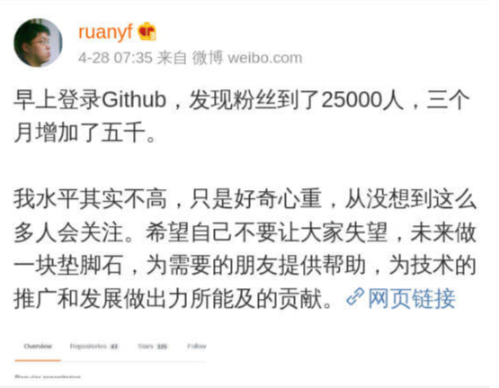
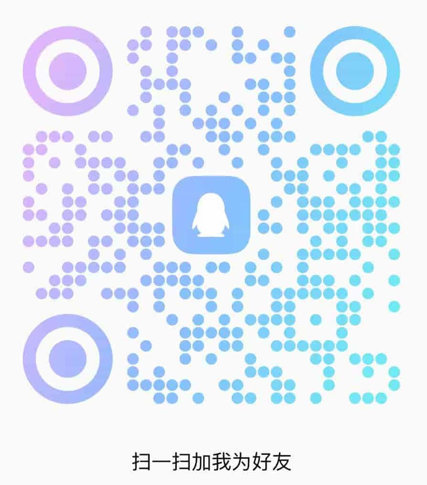

## 个人介绍🧑

::: info Me👥

**我是JacksonYao，热爱编程，乐于分享！**

::: danger respect

不要为过去而后悔，因为已经过去。也不要为将来而忧虑，因为明天还没有来。我们唯一能够把握的就是今天，不念过去，不畏将来，活在当下。对于我们不可改变的东西，我们保持乐观，对于我们可以控制的事情，我们要保持谨慎，做你该做的事情，并且接受它的事与愿违。加油吧，打工人！

:::

## 个人技能🗃

::: warning personalSkills🔥🔥🔥

熟悉 [***Vue***](https://cn.vuejs.org/ "Vue") *，有多个实际项目开发经验，包括 Vue2 ，Vue3， **[VuePress](https://vuepress.vuejs.org/zh/) ， [Nuxt](https://nuxt.com.cn/) ，[Pinia](https://pinia.vuejs.org/)*** 等；

熟悉 ES6+  语法，了解 [***TypeScript*** ](https://typescript.bootcss.com/)；

了解 ***[Node.js](https://nodejs.org/zh-cn)，[Java](https://www.java.com/zh-CN/)*** 可以使用  [***Express***](https://nodejs.cn/express/)，[***Koa***](https://koa.bootcss.com/)， [***egg***](https://www.eggjs.org/zh-CN/intro/quickstart) 框架进行接口开发；

了解 mysql ， mongodb  ，redis，掌握基本增删改查；

了解  *docker ， github actions* ，前端静态化部署；

熟悉 *Photoshop ，Axure ，蓝图* 等工具，能够进行简易的原型设计。

:::

## 工作经历🌎

<iframe src="https://player.bilibili.com/player.html?aid=1602365662&bvid=BV1bm421n7Kx&cid=1483150722&p=1" scrolling="no" border="0" frameborder="no" framespacing="0" allowfullscreen="true" style="width:100%;height:27rem;"> </iframe>

::: info Base🏠

深圳甄创科技有限公司 - ZCIotinc（团队负责人，3人）	2022 年 9 月- 2023 年 6月

::: details 工作内容💻

* 负责公司小程序从零到一的建设；
* 负责页面开发和维护，代码审查，设计原型；
* 通过前端低代码实现，搭建现代化前端工程；
* 使用动态组件完成动态表单，通过配置文件让不同的活动拥有不同的表单内容；
* 开发公用基础组件，如九宫格，大转盘等供团队使用。
* 通过Axure完成原型设计，与 UI 人员进行交涉。
* 负责收集、剪辑、制作视频
* 企业微信平台的维护与交互

:::

## 个人目标🚴‍♀️

::: info Goals

很喜欢阮一峰老师的一句话，向大牛学习，一起加油！

::: warning ruanyf

:::

## 联系方式❤

::: info ContactInformation

###### 学与思，琢与磨，知与行，相交错。奋者，功必成，开创者，业必兴。

| QQ                                               | Wechat                                           |
| ------------------------------------------------ | ------------------------------------------------ |
|  |  |

:::

## 友情打赏🧧

::: info friendlyReward

:::

---
