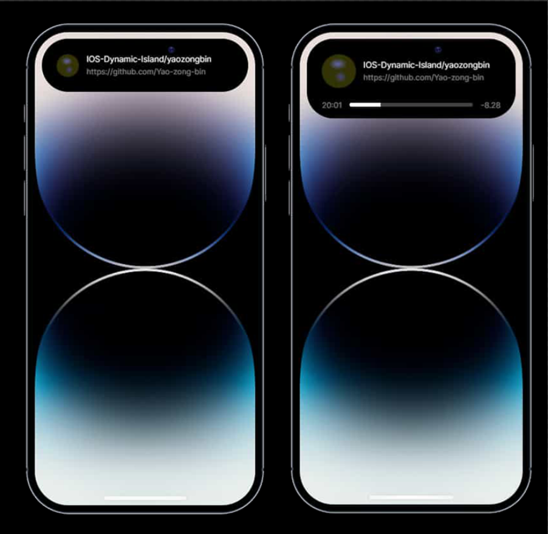

Coding-IOS-IPhone-Dynamic-Music-main  / 仿 iPhone 14 Pro 灵动岛，纯HTML加CSS来仿造14Pro灵动岛，支持响应式，你可以关注我的 [Github](https://github.com/yaozongbin/Coding-IOS-IPhone-Dynamic-Music-main) 来查看源码！

## Operate (点击一下灵动岛)

<iframe src="/assets/mix.html" scrolling="auto" frameborder="0" style="width:100%;height:27rem;" >
</iframe>

## Screenshot(截图)

