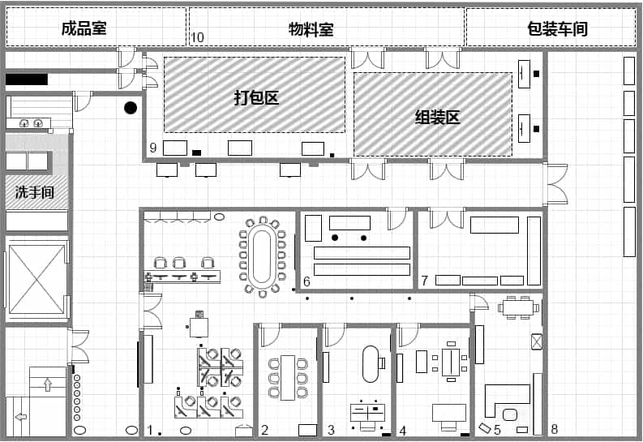
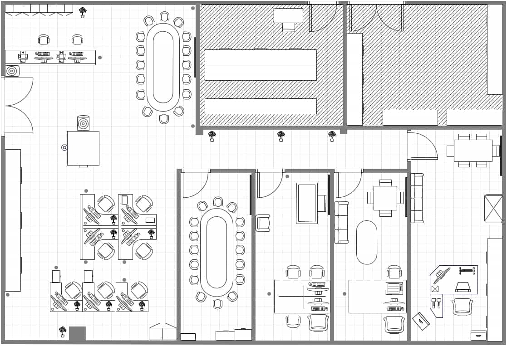
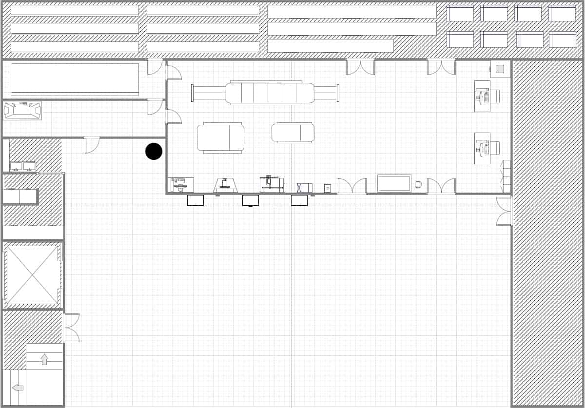

## 前言

*公司结构图通常属于组织结构图（Organizational Chart）的一种，它用来描述公司内部的组织架构和层级关系。以下是几种常见的组织结构图类型：*

1. ***层级结构图** （Hierarchical Chart）：这是最常见的组织结构图类型，它以金字塔形式展示公司的层级结构，从最高领导层到基层员工。*
2. ***功能结构图** （Functional Chart）：这种结构图按照公司的不同职能部门来组织，展示各个部门及其相互关系。*
3. ***产品或服务结构图** ：在这种结构图中，公司被划分为不同的产品线或服务领域，每个领域都有自己的团队和管理层。*
4. ***地区结构图** （Geographic Chart）：这种结构图根据地理位置来组织公司的结构，展示不同地区或国家的分支机构和它们的汇报关系。*
5. ***矩阵结构图** （Matrix Chart）：在矩阵组织结构中，员工可能同时向两个或多个经理汇报，这种结构图展示了这种复杂的汇报关系。*
6. ***扁平结构图** （Flat Chart）：与层级结构图相对，扁平结构图展示了较少的管理层级，通常在初创公司或追求快速决策的组织中使用。*
7. ***虚拟结构图** （Virtual Chart）：这种结构图展示了在虚拟团队或远程工作模式下的组织结构，强调团队成员的职能角色和项目关系。*
8. ***混合结构图** （Hybrid Chart）：结合了多种组织结构的特点，如层级和矩阵结构的元素，以适应复杂的组织需求。*

作品如下：

