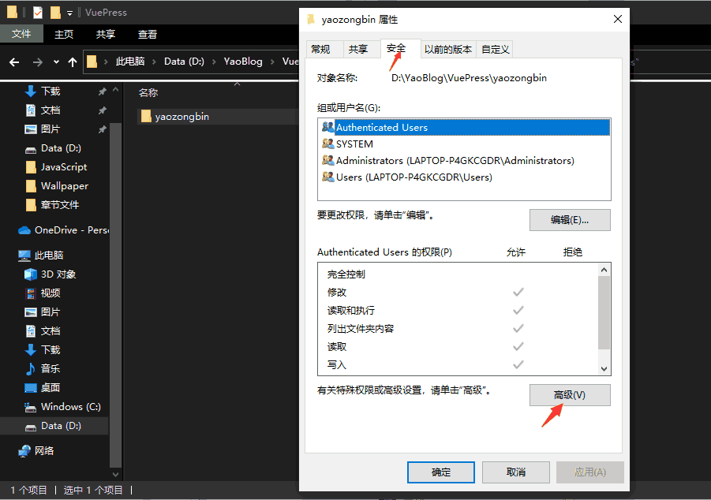

## 前言

1. 最近Win10更新后，发现电脑系统卡顿，多了一些无用的插件，导致了我需要恢复出厂设置，类似于系统重新安装。
2. 重置Win10后，因为更新了用户名，造成之前的所有git仓库，都无法直接拉取代码。

## Git操作错误提示

```apache
admin@DESKTOP-TNI5ROV MINGW64 /d/git/rt-thread/rt-thread pm2
$ git log
fatal: detected dubious ownership in repository at D:/git/rt-thread/rt-thread pm2
D:/git/rt-thread/rt-thread pm2' is owned by:
5-1-5-21-1845045257-1974506225-3199486363-589
but the current user is:
5-1-5-21-1845845257-1974506225-3199486363-1881
To add an exception for this directory, call:
git config --global --add safe.directory D:/git/rt-thread/rt-thread pm2
```

## 解决方法

* 临时的解决方法就是按照提示，在git bash中输入 ``git config --global --add safe.directory D:/git/rt-thread/rt-thread_pm2``但这只能解决当前的git仓库，其他的git仓库都要操作一遍，非常繁琐。并且 ``git config -l``会发现一大串这些操作，看着很不爽。
* 其实就是你电脑恢复出厂设置过，然后导致之前的用户名是Administrator，现在改成了你自己设置的用户名，之前的目录所有者需要改为现在的用户名，所有解决的方法就是 ``更改git仓库文件夹的所有者``，改为当前windows登录的用户即可解决。

## 具体操作

- 选择 git 仓库的文件夹，如果这个文件夹下全是git 仓库，可以选择整个文件夹，鼠标右键【属性】 【安全】【高级】
  
- 所有者与当前的windows登录的账号不一样，【更改】
  
- 输入你Windows当前登录的用户名及确定
  
- 点击【确定】后，目录文件较多，会操作一会
  
- 子文件夹等一起更改就可以了
  

## 更改后的效果

- 更改 git 仓库 文件夹的所有者为当前windows账号，git 的操作正常了
  

## 总结

- 这个操作还是有点耗时，不过，就不用重新拉取代码了，因为拉取代码，也是比较的耗时的。
- 不太清楚 git 为何设置了这个提示，不过更改文件夹用户，这个在 windows上，我是第一次操作。
