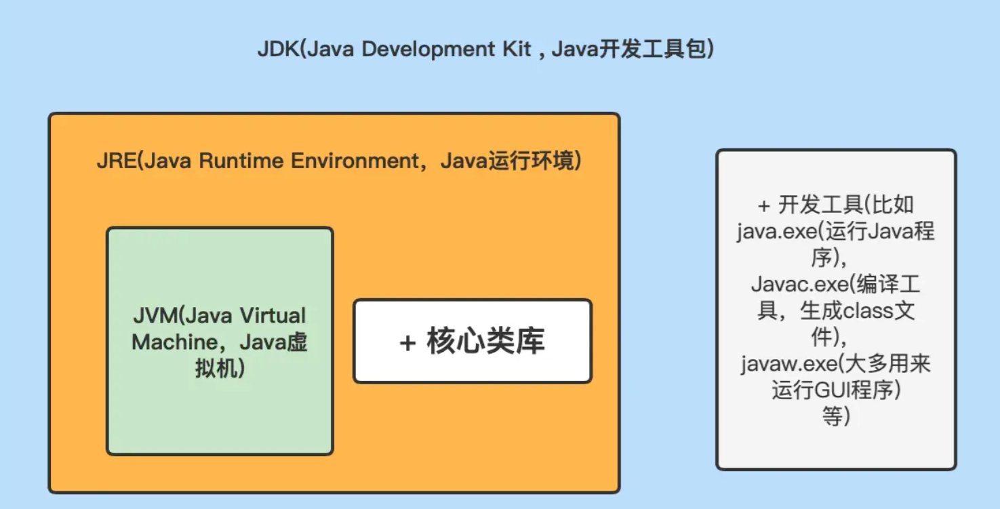
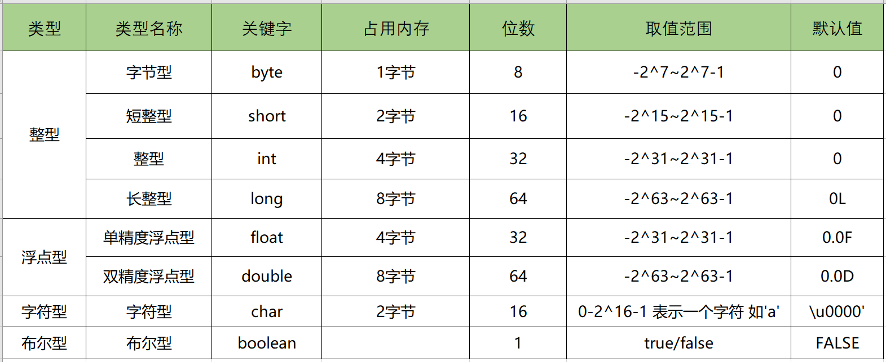
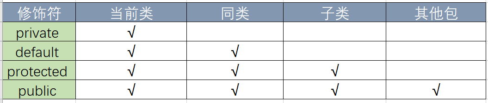

## Java概述

Java是一门面向对象编程语言，不仅吸收了C++语言的各种优点，还摒弃了 C++里难以理解的多继承、指针等概念，因此Java语言具有功能强大和简单易 用两个特征。Java语言作为静态面向对象编程语言的代表，极好地实现了面向对 象理论，允许程序员以优雅的思维方式进行复杂的编程 。

### JVM、JRE和JDK的关系

#### JVM

* Java Virtual Machine是Java虚拟机，Java程序需要运行在虚拟机上，不同的平 台有自己的虚拟机，因此Java语言可以实现跨平台。

#### JRE

* Java Runtime Environment包括Java虚拟机和Java程序所需的核心类库等。核 心类库主要是java.lang包：包含了运行Java程序必不可少的系统类，如基本数 据类型、基本数学函数、字符串处理、线程、异常处理类等，系统缺省加载这个包如果想要运行一个开发好的Java程序，计算机中只需要安装JRE即可。

#### JDK

* Java Development Kit是提供给Java开发人员使用的，其中包含了Java的开发 工具，也包括了JRE。所以安装了JDK，就无需再单独安装JRE了。其中的开发工 具：编译工具(javac.exe)，打包工具(jar.exe)等



### 什么是跨平台性？原理是什么？

* 所谓跨平台性，是指java语言编写的程序，一次编译后，可以在多个系统平台上运行。
* 实现原理：Java程序是通过java虚拟机在系统平台上运行的，只要该系统可以安装相应的java虚拟机，该系统就可以运行java程序。

### Java语言有哪些特点？

* 简单易学（Java语言的语法与C语言和C++语言很接近）
* 面向对象（封装，继承，多态）
* 平台无关性（Java虚拟机实现平台无关性）
* 支持网络编程并且很方便（Java语言诞生本身就是为简化网络编程设计的）
* 支持多线程（多线程机制使应用程序在同一时间并行执行多项任）
* 健壮性（Java语言的强类型机制、异常处理、垃圾的自动收集等）
* 安全性

### Java语言采用何种编码方案？有何特点？

* Java语言采用[Unicode](http://www.unicode.org/standard/WhatIsUnicode.html)编码标准，Unicode（标准码），它为每个字符制订了一 个唯一的数值。
* 因此在任何的语言，平台，程序都可以放心的使用。

### 什么是字节码？采用字节码的大好处是什么

* [字节码](https://baike.baidu.com/item/%E5%AD%97%E8%8A%82%E7%A0%81/9953683?fr=ge_ala)：Java源代码经过虚拟机编译器编译后产生的文件（即扩展为.class的文 件），它不面向任何特定的处理器，只面向虚拟机。
* Java语言通过字节码的方式，在一定程度上解决了传统解释型语言执行效率低的问题，同时又保留了解释型语言可移植的特点。所以Java程序运行时比较高效， 而且，由于字节码并不专对一种特定的机器，因此，Java程序无须重新编译便可在多种不同的计算机上运行。

### 什么是Java程序的主类？应用程序和小程序的主类有何不同？

* 一个程序中可以有多个类，但只能有一个类是主类。在Java应用程序中，这个主类是指包含main()方法的类。
* 而在Java小程序中，这个主类是一个继承自系统 类JApplet或Applet的子类。应用程序的主类不一定要求是public类，但小程序 的主类要求必须是public类。主类是Java程序执行的入口点。

### Java应用程序与小程序之间有那些差别？

* 简单说应用程序是从主线程启动(也就是main()方法)。applet小程序没有main 方法。
* 主要是嵌在浏览器页面上运行(调用init()线程或者run()来启动)，嵌入浏览器这点跟flash的小游戏类似。

### Java和C++的区别

* 都是面向对象的语言，都支持封装、继承和多态
* Java不提供指针来直接访问内存，程序内存更加安全
* Java的类是单继承的，C++支持多重继承；虽然Java的类不可以多继承，但是 接口可以多继承。
* Java有自动内存管理机制，不需要程序员手动释放无用内存

## Java数据类型

### 定义

* Java语言是强类型语言，对于每一种数据都定义了明确的具体的数据类 型，在内存中分配了不同大小的内存空间。

### 基本数据类型分类：

* 数值型
* 整数类型(byte,short,int,long)
* 浮点类型(float,double)
* 字符型(char)
* 布尔型(boolean)

### 引用数据类型：

* 类(class)
* 接口(interface)
* 数组([])

### **Java基本数据类型图**



### switch 是否能作用在 byte 上，是否能作用在 long 上，是否 能作用在 String 上

* 在 Java 5 以前，switch(expr)中，expr 只能是 byte、short、char、int。从 Java5 开始，Java 中引入了枚举类型，expr 也可以是 enum 类型，从 Java 7 开始，expr 还可以是字符串（String），但是长整型（long）在目前所有的版本中都是不可以的。

### 用最有效率的方法计算 2 乘以 8

* 2 << 3（左移 3 位相当于乘以 2 的 3 次方，右移 3 位相当于除以 2 的 3 次 方）。

### Math.round(11.5) 等于多少？Math.round(-11.5) 等于多少

* Math.round(11.5)的返回值是 **12**
* Math.round(-11.5)的返回值是 **-11**
* 四舍五入的原理是在参数上加 0.5 然后进行下取整。

### float f=3.4;是否正确？

* 不正确
* 3.4 是双精度数，将双精度型（double）赋值给浮点型（float）属于 下转型（down-casting，也称为窄化）会造成精度损失，因此需要强制类型转 换float f =(float)3.4; 或者写成 float f =3.4F;。

### short s1 = 1; s1 = s1 + 1;有错吗?short s1 = 1; s1 += 1;有错吗？

* 有错，对于 short s1 = 1; s1 = s1 + 1;由于 1 是 **int** 类型，因此 s1+1 运算结果也是 **int**型，需要强制转换类型才能赋值给 short 型。
* 没错， short s1 = 1; s1 += 1可以正确编译，因为 s1+= 1;相当于 **s1 = (short(s1 + 1)**;其中有隐含的强制类型转换。

## 注释

### 定义：用于解释说明程序的文字

### 分类

```java
# 单行注释 格式： // 注释文字
# 多行注释 格式： /* 注释文字 */
# 文档注释 格式：/** 注释文字 */
```

### 作用

在程序中，尤其是复杂的程序中，适当地加入注释可以增加程序的可读性，有利 于程序的修改、调试和交流。注释的内容在程序编译的时候会被忽视，不会产生 目标代码，注释的部分不会对程序的执行结果产生任何影响。（ 注意事项：多行和文档注释都不能嵌套使用。）

### 访问修饰符 public,private,protected,以及不写（默认）时的区别

* **private** : 在同一类内可见。使用对象：**变量、方法**。 注意：不能修饰类（外部 类）
* **default** (即缺省，什么也不写，不使用任何关键字）: 在同一包内可见，不使用 任何修饰符。使用对象：**类、接口、变量、方法。**
* **protected** : 对同一包内的类和所有子类可见。使用对象：**变量、方法**。 注意： 不能修饰类（外部类）。
* **public** : 对所有类可见。使用对象：**类、接口、变量、方法**

### 访问修饰符圈



## 运算符

### &和&&的区别

* &运算符有两种用法：(1)按位与  (2)逻辑与。
* &&运算符是短路与运算。逻辑与跟短路与的差别是非常巨大的，虽然二者都要 求运算符左右两端的布尔值都是**true** 整个表达式的值才是 **true**。
* &&之所以称 为短路运算，是因为如果&&左边的表达式的值是 **false**，右边的表达式会被直 接短路掉，不会进行运算。

::: tip 注意

逻辑或运算符（|）和短路或运算符（||）的差别也是如此。

:::

## 关键字

### Java 有没有 goto？

* goto 是 Java 中的保留字，在目前版本的 Java 中没有使用。

### final关键字有什么用？

用于修饰类、属性和方法；

* 被final修饰的类不可以被**继承。**
* 被final修饰的方法不可以被**重写。**
* 被final修饰的变量不可以被**改变**，被final修饰不可变的是变量的引用，而不是引用指向的内容，引用指向的内容可以改变。

### final finally finalize区别

* **final**可以修饰类、变量、方法，修饰类表示该类不能被继承、修饰方法表示该方法不能被重写、修饰变量表示该变量是一个常量不能被重新赋值。
* **finally**一般作用在try-catch代码块中，在处理异常的时候，通常我们将一定要执行的代码方法finally代码块中，表示不管是否出现异常，该代码块都会执行，一般用来存放一些关闭资源的代码。
* **finalize**是一个方法，属于Object类的一个方法，而Object类是所有类的父类，该方法一般由垃圾回收器来调用，当我们调用System.gc() 方法的时候，由垃圾回收器调用finalize()，回收垃圾，一个对象是否可回收的最后判断。

### this 关键字的作用

this是自身的一个对象，代表对象本身，可以理解为：指向对象本身的一个指针。

this的用法在java中大体可以分为3种：

1. 普通的直接引用，this相当于是指向当前对象本身。
2. 形参与成员名字重名，用this来区分：

   ```
   public Person(String name, int age) {
        this.name = name;
        this.age = age;
   }
   ```
3. 引用本类的构造函数

   ```java
   class Person{
      private String name;
      private int age;
      public Person() {
      }
      public Person(String name) {
         this.name = name;
      }
      public Person(String name, int age) {
         this(name);
         this.age = age;
      }
   }
   ```

### super关键字的用法

super可以理解为是指向自己超（父）类对象的一个指针，而这个超类指的是离自己最近的一个父类。

### super也有三种用法：

1. 普通的直接引用，与this类似，super相当于是指向当前对象的父类的引用，这样就可以用 super.xxx 来引用父类的成员。
2. 子类中的成员变量或方法与父类中的成员变量或方法同名时，用super进行区分。

   ```java
   class Person{
      protected String name;

      public Person(String name) {
         this.name = name;
      }
   }

   class Student extends Person{
      private String name;
      public Student(String name, String name1) {
         super(name);
         this.name = name1;
      }

      public void getInfo(){
         System.out.println(this.name); //Child
         System.out.println(super.name); //Father
      }
   }

   public class Test {
      public static void main(String[] args) {
         Student s1 = new Student("Father","Child");
         s1.getInfo();
      }
   }
   ```
3. super（参数）：调用父类中的某一个构造函数（应该为构造函数中的第一条语句）。
4. this（参数）：调用本类中另一种形式的构造函数（应该为构造函数中的第一条语句）。
