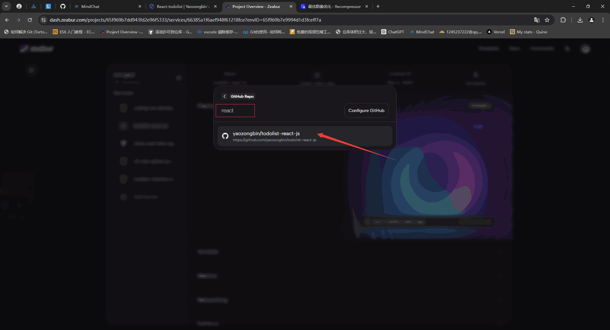

## 项目地址

项目地址：[react-todolist](https://react-todolist.zeabur.app/)

## 效果展示

<iframe src="https://react-todolist.zeabur.app/" scrolling="auto" frameborder="0" style="width:100%;height:45rem;" >
</iframe>

::: info 

`todolist`是指待办事项列表，通常用于记录和管理个人或团队的任务。它是一个简单但非常有用的工具，可以帮助人们跟踪他们需要完成的任务，并确保不会遗漏任何重要的事情。

通常，一个todolist应用程序允许用户创建任务、设置任务的截止日期、标记任务的优先级、添加备注等。用户可以根据任务的完成情况标记任务为已完成或未完成，并且通常还可以对任务进行排序或过滤。

在现代的日常生活中，`todolist`应用程序已经成为了许多人组织生活和工作的重要工具，它们可以是纸质的笔记本、手机应用程序或者电脑上的软件等形式存在。

:::

## 实现

要创建一个新的 `React`项目，你可以使用 `Create React App`工具。确保你已经安装了`Node.js`和`npm`，然后打开命令行工具，执行以下命令：

```bash
npx create-react-app my-react-app
```

这里的 `my-react-app`是你想要创建的React项目的名称，你可以根据需要替换成你想要的名称。执行上述命令后，Create React App将会自动下载并安装所需的依赖，并生成一个初始的React项目结构。安装完成后，进入项目目录：

```bash
cd my-react-app
```


然后运行以下命令安装相关依赖：

```bash
npm i 或 pnpm i
```

最后运行以下命令启动开发服务器：

```bash
npm run dev 或 pnpm dev
```

这将启动一个本地开发服务器，并在浏览器中打开你的新的React应用程序。现在你就可以开始开发你的React项目了！❤

::: info 以上命令执行完后的项目文件


::: warning 在src文件夹下的components文件夹建立以下文件


```js
// EditTodoForm.js
import React, { useState } from "react";
export const EditTodoForm = ({ editTodo, task }) => {
  const [value, setValue] = useState(task.task);

  const handleSubmit = (e) => {
    // preventDefault() 阻止表单的默认提交行为
    e.preventDefault();
    editTodo(value, task.id);
  };

  return (
    <form onSubmit={handleSubmit} className="TodoForm">
      <input
        type="text"
        value={value}
        onChange={(e) => setValue(e.target.value)}
        className="todo-input"
        placeholder="Update Your Task"
      />
      <button type="submit" className="todo-btn">
        Edit Task
      </button>
    </form>
  );
};

```


```js
// Todo.js
import React from "react";
import { FontAwesomeIcon } from "@fortawesome/react-fontawesome";
import { faPenToSquare } from "@fortawesome/free-solid-svg-icons";
import { faTrash } from "@fortawesome/free-solid-svg-icons";

export const Todo = ({ task, deleteTodo, editTodo, toggleComplete }) => {
  return (
    <div className="Todo">
      <p
        className={`${task.completed ? "completed" : "incompleted"}`}
        onClick={() => toggleComplete(task.id)}
      >
        {task.task}
      </p>
      <div>
        <FontAwesomeIcon
          title="编辑"
          className="edit-icon"
          icon={faPenToSquare}
          onClick={() => editTodo(task.id)}
        />
        <FontAwesomeIcon
          title="删除"
          className="delete-icon"
          icon={faTrash}
          onClick={() => deleteTodo(task.id)}
        />
      </div>
    </div>
  );
};

```


```js
// TodoForm.js
import React, { useState } from "react";
export const TodoForm = ({ addTodo }) => {
  const [value, setValue] = useState("");

  const handleSubmit = (e) => {
    e.preventDefault();
    if (value) {
      // 添加todo
      addTodo(value);
      // 提交后清空表单
      setValue("");
    }
  };

  return (
    <form onSubmit={handleSubmit} className="TodoForm">
      <input
        type="text"
        value={value}
        onChange={(e) => setValue(e.target.value)}
        className="todo-input"
        placeholder="Add your task in the input box!"
      />
      <button type="submit" className="todo-btn">
        Add Task
      </button>
    </form>
  );
};

```


```js
// TodoWrapper.js
import React, { useState } from "react";
import { v4 as uuidv4 } from "uuid";
import { Todo } from "./Todo";
import { TodoForm } from "./TodoForm";
import { EditTodoForm } from "./EditTodoForm";

export const TodoWrapper = () => {
  const [todos, setTodos] = useState([]);

  const addTodo = (todo) => {
    setTodos([
      ...todos,
      { id: uuidv4(), task: todo, completed: false, isEditing: false },
    ]);
  };

  const deleteTodo = (id) => setTodos(todos.filter((todo) => todo.id !== id));

  const toggleComplete = (id) => {
    setTodos(
      todos.map((todo) =>
        todo.id === id ? { ...todo, completed: !todo.completed } : todo
      )
    );
  };

  const editTodo = (id) => {
    setTodos(
      todos.map((todo) =>
        todo.id === id ? { ...todo, isEditing: !todo.isEditing } : todo
      )
    );
  };

  const editTask = (task, id) => {
    setTodos(
      todos.map((todo) =>
        todo.id === id ? { ...todo, task, isEditing: !todo.isEditing } : todo
      )
    );
  };

  return (
    <>
      <h1>todolist</h1>
      <div className="TodoWrapper">
        <h2>todolist-react-js</h2>
        <TodoForm addTodo={addTodo} />
        {/* 添加todo的时候才显示 */}
        {todos.map((todo) =>
          todo.isEditing ? (
            <EditTodoForm editTodo={editTask} task={todo} />
          ) : (
            <Todo
              key={todo.id}
              task={todo}
              deleteTodo={deleteTodo}
              editTodo={editTodo}
              toggleComplete={toggleComplete}
            />
          )
        )}
        <footer>
          <a href="https://github.com/yaozongbin/todolist-react-js">
            MIT © 2024-PRESENT @yaozongbin
          </a>
        </footer>
      </div>
    </>
  );
};

```


```js
// TodoWrapperLocalStorage.js
import React, { useState, useEffect } from "react";
import { TodoForm } from "./TodoForm";
import { v4 as uuidv4 } from "uuid";
import { Todo } from "./Todo";
import { EditTodoForm } from "./EditTodoForm";
uuidv4();

export const TodoWrapperLocalStorage = () => {
  const [todos, setTodos] = useState([]);
  useEffect(() => {
    const savedTodos = JSON.parse(localStorage.getItem("todos")) || [];
    setTodos(savedTodos);
  }, []);

  const addTodo = (todo) => {
    const newTodos = [
      ...todos,
      { id: uuidv4(), task: todo, completed: false, isEditing: false },
    ];
    setTodos(newTodos);
    localStorage.setItem("todos", JSON.stringify(newTodos));
  };

  const toggleComplete = (id) => {
    const newTodos = todos.map((todo) =>
      todo.id === id ? { ...todo, completed: !todo.completed } : todo
    );
    setTodos(newTodos);
    localStorage.setItem("todos", JSON.stringify(newTodos));
  };

  const deleteTodo = (id) => {
    const newTodos = todos.filter((todo) => todo.id !== id);
    setTodos(newTodos);
    localStorage.setItem("todos", JSON.stringify(newTodos));
  };

  const editTodo = (id) => {
    setTodos(
      todos.map((todo) =>
        todo.id === id ? { ...todo, isEditing: !todo.isEditing } : todo
      )
    );
  };

  const editTask = (task, id) => {
    const newTodos = todos.map((todo) =>
      todo.id === id ? { ...todo, task, isEditing: !todo.isEditing } : todo
    );
    setTodos(newTodos);
    localStorage.setItem("todos", JSON.stringify(newTodos));
  };
  return (
    <>
      <h1>todolist</h1>
      <div className="TodoWrapper">
        <h2>todolist-react-js</h2>
        <TodoForm addTodo={addTodo} />
        {/* 添加todo的时候才显示 */}
        {todos.map((todo) =>
          todo.isEditing ? (
            <EditTodoForm editTodo={editTask} task={todo} />
          ) : (
            <Todo
              key={todo.id}
              task={todo}
              deleteTodo={deleteTodo}
              editTodo={editTodo}
              toggleComplete={toggleComplete}
            />
          )
        )}
        <footer>
          <a href="https://github.com/yaozongbin/todolist-react-js">
            MIT © 2024-PRESENT @yaozongbin
          </a>
        </footer>
      </div>
    </>
  );
};

```

:::

## 打包部署

::: info BuildAndDeployment

```bash
# 打包命令
pnpm bulid
```


打包后会在项目自动生成build文件夹，文件夹可以放在[zeabur](https://dash.zeabur.com/)实施静态部署。


git push到相关仓库后打开[zeabur](https://dash.zeabur.com/)官网(不会git的小伙伴可以先学习[git的使用](/docs/git_use/git_1.html))


首先我们点击github这里，通过搜索框搜索react-todolist这个仓库



其次zeabur自动部署，之后你只要负责更改自定义域名和根目录即可


:::
