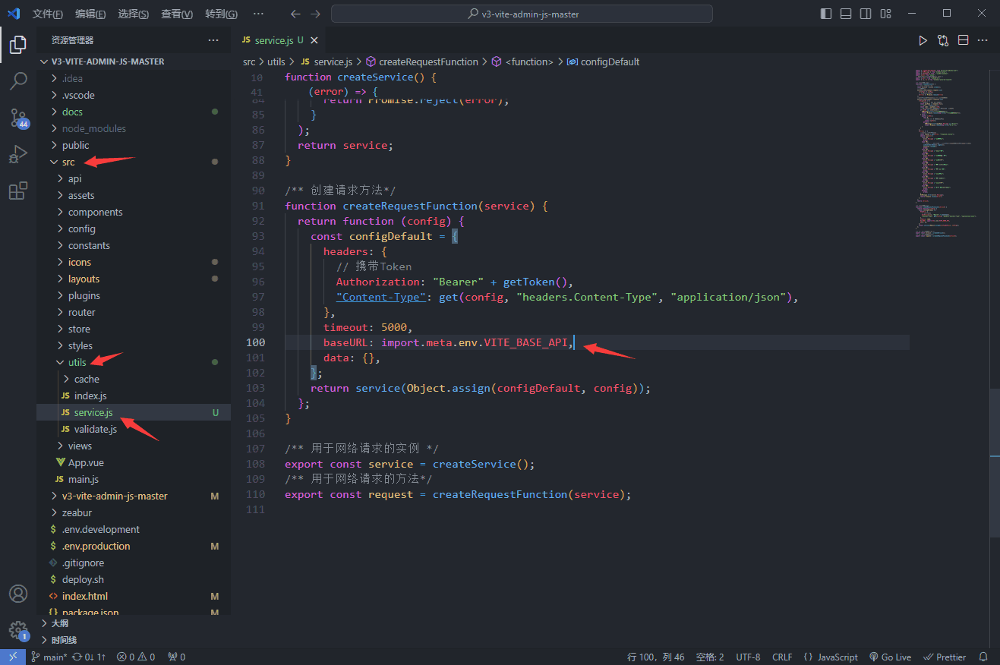

## 前言

在[【V3 Admin Vite】环境、下载、运行项目(1)](v3AdminVite1.md) 基础上，本文将教会你如何使用该项目对接你自己的后端接口、如何处理接口跨域问题、如何正确的打包部署前端静态文件。

项目链接①：[v3-vite-admin-js-master.zeabur.app](https://yaozongbin.pages.dev/blogs/category/Vue/v3AdminVite1.html)

项目链接②：[yaozongbin.github.io/v3-vite-admin-js-master](https://yaozongbin.github.io/v3-vite-admin-js-master)

## 设置后端接口

前端所有的请求最终都是通过 `Axios `来发送的，我们可以找到封装 `Axios `的文件，看见后端接口的 `baseURL` 是 `import.meta.env.VITE_BASE_API`



然后我们可以在 `.env` 配置文件中找到定义 `VITE_BASE_API` 的地方：


::: warning Tip

`.env.development`代表开发环境配置，` .env.production`代表正式环境配置。

:::

## 跨域 CORS

如果你并不想用反向代理的方式来调用接口并解决跨域问题，那你应该将你的 `VITE_BASE_API` 配置填写为完整的绝对路径：

```bash
## 后端接口公共路径（如果解决跨域问题采用 CORS 就需要写全路径）
VITE_BASE_API = 'https://mock.mengxuegu.com/mock/63218b5fb4c53348ed2bc212/api/v1'
```

想了解更多关于跨域的知识，可以阅读这篇文章：[跨域](https://juejin.cn/post/6999428822588194846)

## 打包

::: info 接口公共路径

打包的话比较简单，我们以正式环境配置 `.env.production` 为例。由于我们打包后部署的服务器上没有 `Nginx` 等工具帮助我们实现反向代理，所以我们就必须采用 CORS 的方式解决跨域问题，就需要将 `VITE_BASE_API` 写完整，也就是：

```bash
## 后端接口公共路径（如果解决跨域问题采用 CORS 就需要写全路径）
VITE_BASE_API = 'https://mock.mengxuegu.com/mock/63218b5fb4c53348ed2bc212/api/v1'
```

:::

::: info 路由模式

然后选择一种路由方式（`hash` 或 `html5`），模板本身默认是 `hash 模式`，如果你想切换为 html5 模式的话，更改 `VITE_ROUTER_HISTORY` 配置即可：

```bash
## 路由模式 hash 或 html5
VITE_ROUTER_HISTORY = 'hash'
```

::: warning Tip

但要要注意使用 `html5` 模式的话，就必须得在部署前端的服务器上新增一些配置，至于为什么，你可以仔细阅读这篇：[Vue-Router/html5](https://router.vuejs.org/zh/guide/essentials/history-mode.html#html5-%E6%A8%A1%E5%BC%8F)

:::

::: info 打包路径

最后再设置一下打包路径 `VITE_PUBLIC_PATH` 即可。模板项目本身是需要部署到这个域名下：`https://yaozongbin.github.io/v3-admin-vite-js-master/`，所以我们需要这么填写：

```bash
## 打包路径（就是网站前缀，例如部署到 https://un-pany.github.io/v3-admin-vite/ 域名下，就需要填写 /v3-admin-vite/）
VITE_PUBLIC_PATH = '/v3-admin-vite-js-master/'
```

::: warning Tip

假如是要部署到 `https://xxx.com/yyy/` 下，那么就需要填写 `VITE_PUBLIC_PATH = '/yyy/'`

假如是要部署到 `https://xxx.com/` 下，那么就需要填写 `VITE_PUBLIC_PATH = '/'`

:::

### 打包运行命令

打开 `package.json` 文件，可以看见打包该项目内置的命令：


```bash
## 项目打包命令
pnpm build
```

打包完成后，就可以在目录下，看见一个名为 `docs` 的静态资源文件夹，这整个文件夹就是需要丢到前端服务器上去的东西。


## V3 Admin Vite 相关链接

* [V3 Admin Vite 中文文档](https://juejin.cn/post/7089377403717287972)
* [Github/un-pany](https://github.com/un-pany/v3-admin-vite)
* [Gitee/un-pany](https://gitee.com/un-pany/v3-admin-vite)
