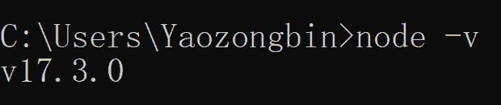
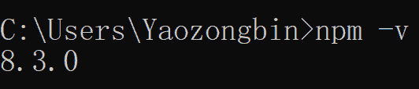
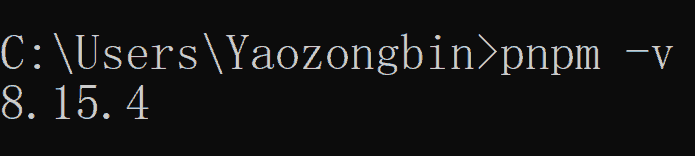
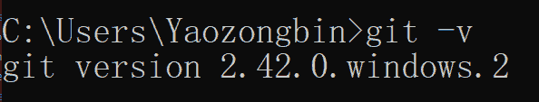
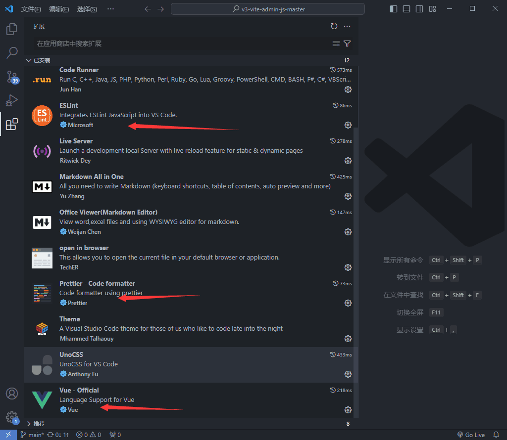
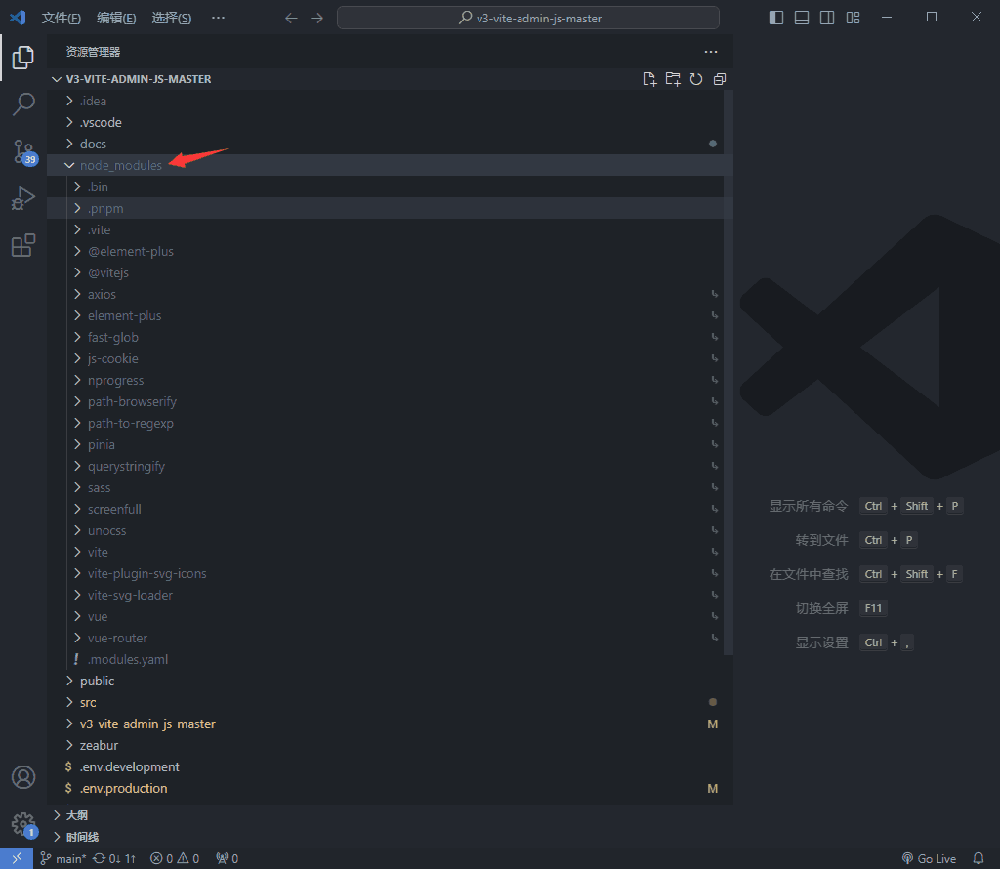
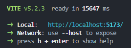
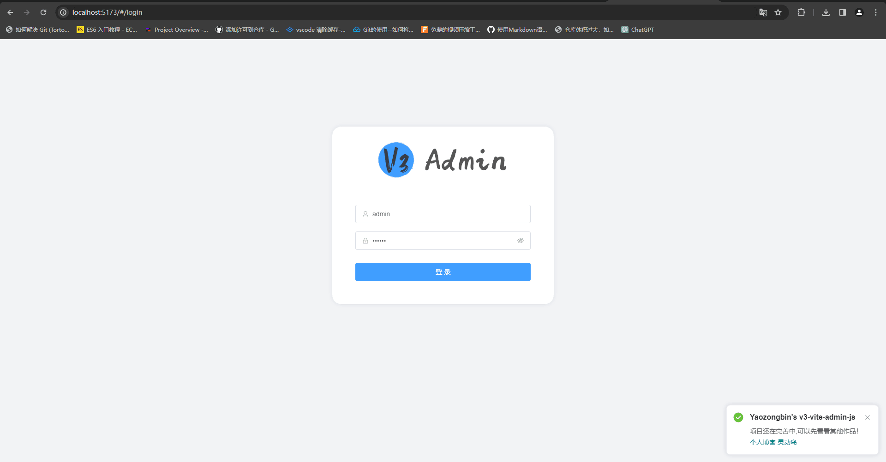

## 前言

基于作者[V3 Admin Vite@pany](https://juejin.cn/post/7207824074708680763)的 `TS`版本开发，本人进行二次开发 `JS`版本后台管理系统是为了提升技能水平和职业发展的重要一步。通过系统学习和实践，我可以深入理解后台管理系统的核心原理和功能模块，掌握常用的开发工具和技术，如前端框架、后端语言和数据库管理等。这不仅可以增强我的软件开发能力，还能够为我提供更广阔的就业机会和职业发展空间。在学习过程中，不断积累经验并与他人交流合作，将有助于我不断提升自己。

项目链接①：[v3-vite-admin-js-master.zeabur.app](https://v3-vite-admin-js-master.zeabur.app/#/dashboard)  

项目链接②：[yaozongbin.github.io/v3-vite-admin-js-master](https://yaozongbin.github.io/v3-vite-admin-js-master)

## 目的

目的是为了学习前端开发需要的环境从零开始配置好，并将 V3 Admin Vite 在本地运行起来，在[Github Page](https://pages.github.com/)、[Zeabur](https://dash.zeabur.com/)部署上去。

## 配置本地开发环境

### Node

::: info node.js

运行js文件需要node.js才能跑起来,所以第一步我们要去[node](https://nodejs.org/zh-cn/)官网下载node.js,般选择最新的 LTS （长期维护）版本即可（在编写本文时，我的电脑使用的是 `17.3.0` 版本）。

安装完成后，打开你电脑的命令行窗口，输入命令：`node -v`，即可查看并确认刚刚安装的 node 版本。



::: warning Tip

`不建议版本：16.x`  ❌

`建议版本：18.x 或 20+` ✔

:::

### NPM

::: info npm.js

下载并安装好 node 之后，就会自动携带 [npm ](https://www.npmjs.com/)了，所以你什么都不用管，直接运行命令查看自己本地的 npm 版本即可：`npm -v`



::: warning Tip

`不建议版本：node.js < 16`  ❌

`建议版本：node.js >= 18 即可`  ✔

:::

### Pnpm

::: info pnpm

推荐使用Pnpm来命令来安装V3 Admin Vite第三方依赖，Pnpm在依赖管理方式、安装速度、本地缓存方面都更胜npm一筹，官方安装方式：[Pnpm](https://pnpm.io/zh/installation)(选择其中一种安装方式即可，我这边使用npm全局安装)

```bash
## 全局安装pnpm
npm install -g pnpm
## pnpm -v 查询版本号
```



::: warning Tip

`不建议版本：7.x `❌

`建议版本：8.x 或 最新版本` ✔

:::

### IDE

::: info 编辑器

个人更喜欢 [VsCode](https://code.visualstudio.com/Download) ，当然收费的 [WebStorm](https://www.jetbrains.com/zh-cn/webstorm/download/#section=windows) 也不错。萝卜青菜，各有所爱吧。

::: warning Tip

`建议版本：最新版本`

:::

### Git

::: info Git

Git负责 `push`代码，运行 `deploy.sh`执行文件。Git 就不多介绍了，具体可以看我的文章 [什么是Git？](https://yaozongbin.gitee.io/yaozongbin/docs/git_use/git_1.html)

```bash
## 查看版本号 git -v
git -v
```



::: warning Tip

`建议版本：最新版本`

:::

## 运行项目

打开 `VsCode`，安装以下插件便于开发项目，安装完你重启 `VsCode`即可。



::: info Use

`Vue3` 项目对应的是 `Volar` 插件(`Volar`已改名为 `Vue-Official`)✔✔✔

:::

::: danger Disable

记得禁用 `Vue2`的 `Vetur`插件！ ❌❌❌

:::

### 安装依赖

依次点击 VsCode 顶部的 Terminal（终端）、New Terminal（新建终端），在底部弹出的命令行窗口中输入以下命令:

```bash
## 安装依赖 pnpm i 或 pnpm install
pnpm i 
pnpm install
```

安装好后的效果：



### 启动项目

还是点击 VsCode 顶部的 Terminal（终端）、New Terminal（新建终端），在底部弹出的命令行窗口中输入以下命令:

```bash
## 启动项目
pnpm dev
```

启动后的效果：



在谷歌浏览器 `Chrome`中访问以上链接



## V3 Admin Vite 相关链接

* [V3 Admin Vite 中文文档](https://juejin.cn/post/7089377403717287972)
* [Github/un-pany](https://github.com/un-pany/v3-admin-vite)
* [Gitee/un-pany](https://gitee.com/un-pany/v3-admin-vite)
