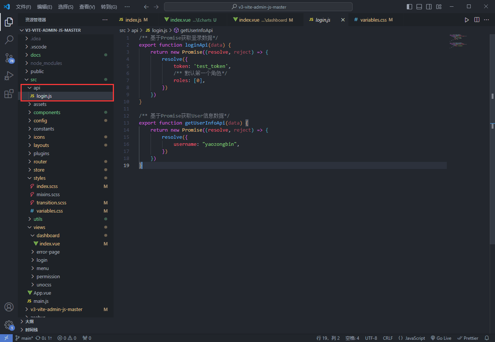
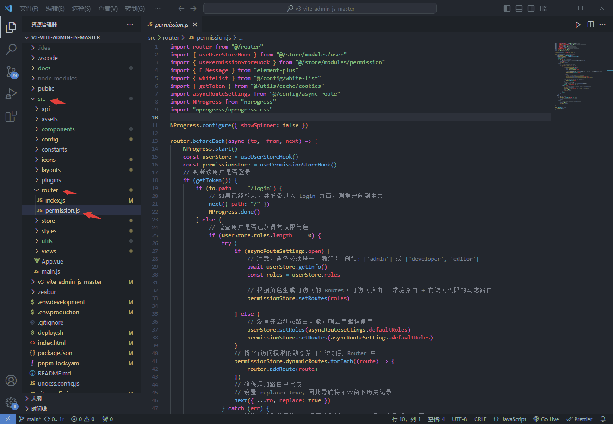
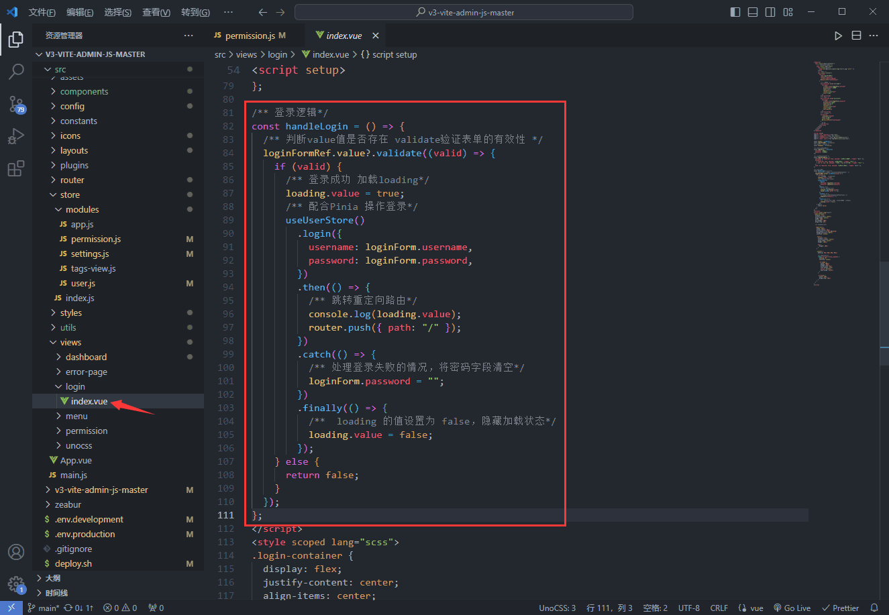

## 前言

在[【V3 Admin Vite】接口、跨域、打包(2)](v3AdminVite2.md) 基础上，本文将教会你如何使用该项目掌握登录模块涉及 (API、Axios、Pinia、路由守卫、鉴权)。

项目链接①：[v3-vite-admin-js-master.zeabur.app](https://v3-vite-admin-js-master.zeabur.app/#/dashboard)

项目链接②：[yaozongbin.github.io/v3-vite-admin-js-master](https://yaozongbin.github.io/v3-vite-admin-js-master)

## 目的

本文将通过登录模块教会你配置 `api `接口、在页面上调用接口发起请求、`Pinia `保存用户信息、经过路由守卫的拦截，成功跳转到首页、`Token `鉴权，判断是否退出登录。

## 配置登录接口

### 建立目录结构

::: info 目录结构

在 `src`目录下新建 `api`目录存放 `login.js`，这个文件夹即代表了登录模块。



::: warning 注意

注意是登录模块，不止是登录接口。如果该模块下还有子模块的话，你可以继续往下面再建立子模块的文件夹

:::

### 路由守卫以及校验登录表单

::: info 路由守卫

`@/router/permission.js`



```js
import router from "@/router"
import { useUserStoreHook } from "@/store/modules/user"
import { usePermissionStoreHook } from "@/store/modules/permission"
import { ElMessage } from "element-plus"
import { whiteList } from "@/config/white-list"
import { getToken } from "@/utils/cache/cookies"
import asyncRouteSettings from "@/config/async-route"
import NProgress from "nprogress"
import "nprogress/nprogress.css"

NProgress.configure({ showSpinner: false })

router.beforeEach(async (to, _from, next) => {
    NProgress.start()
    const userStore = useUserStoreHook()
    const permissionStore = usePermissionStoreHook()
    // 判断该用户是否登录
    if (getToken()) {
        if (to.path === "/login") {
            // 如果已经登录，并准备进入 Login 页面，则重定向到主页
            next({ path: "/" })
            NProgress.done()
        } else {
            // 检查用户是否已获得其权限角色
            if (userStore.roles.length === 0) {
                try {
                    if (asyncRouteSettings.open) {
                        // 注意：角色必须是一个数组！ 例如: ['admin'] 或 ['developer', 'editor']
                        await userStore.getInfo()
                        const roles = userStore.roles

                        // 根据角色生成可访问的 Routes（可访问路由 = 常驻路由 + 有访问权限的动态路由）
                        permissionStore.setRoutes(roles)

                    } else {
                        // 没有开启动态路由功能，则启用默认角色
                        userStore.setRoles(asyncRouteSettings.defaultRoles)
                        permissionStore.setRoutes(asyncRouteSettings.defaultRoles)
                    }
                    // 将'有访问权限的动态路由' 添加到 Router 中
                    permissionStore.dynamicRoutes.forEach((route) => {
                        router.addRoute(route)
                    })
                    // 确保添加路由已完成
                    // 设置 replace: true, 因此导航将不会留下历史记录
                    next({ ...to, replace: true })
                } catch (err) {
                    // 过程中发生任何错误，都直接重置 Token，并重定向到登录页面
                    userStore.resetToken()
                    ElMessage.error(err.message || "路由守卫过程发生错误")
                    next("/login")
                    NProgress.done()
                }
            } else {
                next()
            }
        }
    } else {
        // 如果没有 Token
        if (whiteList.indexOf(to.path) !== -1) {
            // 如果在免登录的白名单中，则直接进入
            next()
        } else {
            // 其他没有访问权限的页面将被重定向到登录页面
            next("/login")
            NProgress.done()
        }
    }
})

router.afterEach(() => {
    NProgress.done()
})

```

设置点击登录按钮

```js
/** 登录逻辑*/
const handleLogin = () => {
  /** 判断value值是否存在 validate验证表单的有效性 */
  loginFormRef.value?.validate((valid) => {
    if (valid) {
      /** 登录成功 加载loading*/
      loading.value = true;
      /** 配合Pinia 操作登录*/
      useUserStore()
        .login({
          username: loginForm.username,
          password: loginForm.password,
        })
        .then(() => {
          /** 跳转重定向路由*/
          console.log(loading.value);
          router.push({ path: "/" });
        })
        .catch(() => {
          /** 处理登录失败的情况，将密码字段清空*/
          loginForm.password = "";
        })
        .finally(() => {
          /**  loading 的值设置为 false，隐藏加载状态*/
          loading.value = false;
        });
    } else {
      return false;
    }
  });
};
```



这里的 `loginFormRef.value?.validate` 是校验登录表单，调用该 Store 的 `login action`，并传入 loginFormData 参数（用户名、密码、验证码）即可。

`login action` 返回值是一个 Promise，所以我们后面链式跟一个 `.then` 、 `.catch` 和 `.finally`，接口调用成功则会执行 `.then` （跳转到首页),如果途中发生错误，则会执行 `.catch`，而无论什么情况都会执行 `.finally`

::: warning 注意

路由守卫全部的代码如上，由于注释已经写的很清楚了，建议大家慢慢的仔细阅读即可，我这里只简单概述一下路由守卫做了什么事：

1. 判断用户是否登录，没登录则只能进入白名单页面，比如登录页。
2. 如果已经登录，那么将不允许进入登录页。
3. 如果已经登录，那么还要检查是否拿到用户角色，如果没有，则要调用用户详情接口。
4. 如果开启了动态路由功能，就根据角色去过滤动态路由；如果没有开启动态路由功能，则生成所有路由。
5. 不管什么情况，一旦发生错误，就重置 Token，并重定向到登录页。

:::

## V3 Admin Vite 相关链接

* [V3 Admin Vite 中文文档](https://juejin.cn/post/7089377403717287972)
* [Github/un-pany](https://github.com/un-pany/v3-admin-vite)
* [Gitee/un-pany](https://gitee.com/un-pany/v3-admin-vite)
