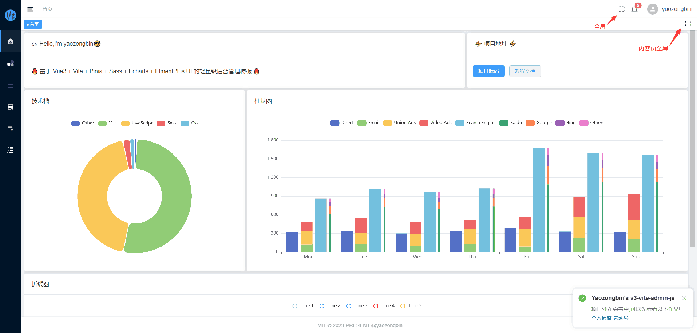
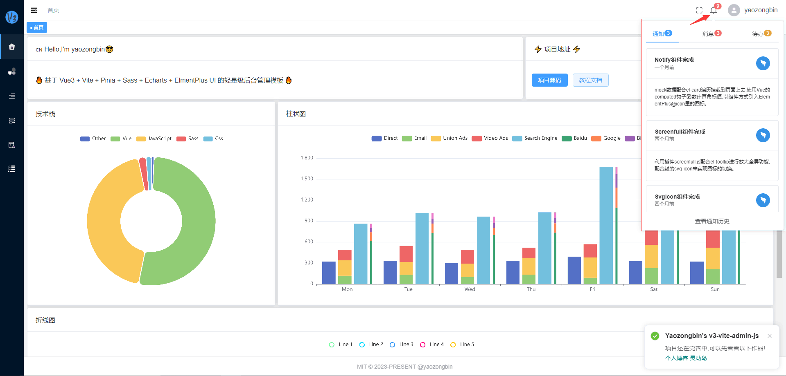
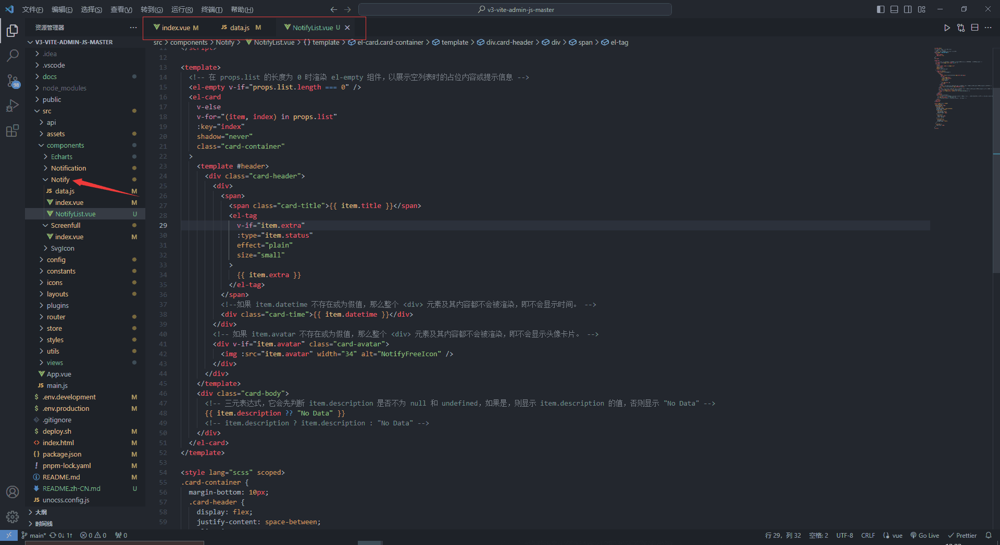

## 前言

基于[【V3 Admin Vite】平台配置（涉及布局、路由菜单、全局样式配置）(4)](v3AdminVite4.md) 的内容继续续上，本文会讲解[V3-Admin-Vite](https://v3-vite-admin-js-master.zeabur.app/#/dashboard)平台相关配置。

项目链接①：[v3-vite-admin-js-master.zeabur.app](https://v3-vite-admin-js-master.zeabur.app/#/dashboard)

项目链接②：[yaozongbin.github.io/v3-vite-admin-js-master](https://yaozongbin.github.io/v3-vite-admin-js-master)

## 目的

本文将带你学习该项目的全屏效果、消息通知、Echarts、标签页、Notification功能，这些功能可以为你的项目增添很多价值和互动性。

## 全屏功能

::: info screenfull

全屏效果是通过`Element-plus` UI组件库和`Screenfull`的JavaScript库配合起来让网页中的元素进入全屏模式。



::: warning achieve

  1.确保你的vue项目中安装并引入 `Element Plus` 组件库，确保它能够正常工作。

```
npm install element-plus --save
```

2. 然后，在你的 Vue 组件中引入 screenfull.js 库，并且在需要的时候使用它来实现全屏效果。你可以在组件的 mounted 钩子函数中初始化 screenfull.js，然后通过点击某个按钮或者其他交互事件触发全屏操作。`<script setup>`

```js
import { ref, onUnmounted } from "vue";
import { ElMessage } from "element-plus";
import screenfull from "screenfull"; //不支持iPhone机型
// import { useFullscreen } from "@vueuse/core";

const props = defineProps({
  /** 全屏的元素，默认是 html */
  element: {
    type: String,
    default: "html",
  },
  /** 打开全屏提示语 */
  openTips: {
    type: String,
    default: "全屏",
  },
  /** 关闭全屏提示语 */
  exitTips: {
    type: String,
    default: "退出全屏",
  },
});

/** 创建一个响应式的tips变量，初始值为props.openTips*/
const tips = ref(props.openTips);
/**  创建一个响应式的isFullscreen变量，初始值为false*/
const isFullScreen = ref(false);


const clickFullscreen = () => {
  /** 根据props.element的值来选择相应的元素，如果找到匹配的元素，则将其赋值给dom变量，否则将dom设置为undefined*/
  const dom = document.querySelector(props.element) || undefined;
  if (!screenfull.isEnabled) {
    ElMessage.warning("您的浏览器无法工作");
    return;
  }
  /** 调用screenfull库的toggle方法配合dom来切换全屏状态*/
  screenfull.toggle(dom);
};

/** 定义了一个change函数，用于在全屏状态发生变化时更新isFullscreen和tips的值*/
const change = () => {
  isFullscreen.value = screenfull.isFullscreen;
  tips.value = screenfull.isFullscreen ? props.exitTips : props.openTips;
};

/** 使用screenfull库的on方法来监听全屏状态的变化，并在变化时调用change函数。*/
screenfull.on("change", change);

/** 在组件卸载时，使用onUnmounted钩子来清除全屏状态的监听*/
onUnmounted(() => {
  if (screenfull.isEnabled) {
    screenfull.off("change", change);
  }
});

</script>

```

3. 在你的screenfull组件下，绑定点击事件，用于触发全屏操作。

```html
<template>
  <!-- screenfull.js (不支持iPhone机型的Safari浏览器)-->
  <div @click="clickFullscreen">
    <el-tooltip effect="dark" :content="tips" placement="bottom">
      <svg-icon :name="isFullScreen ? 'fullscreen-exit' : 'fullscreen'" />
    </el-tooltip>
  </div>
</template>
```

通过以上步骤，你就可以在你的 Vue.js 项目中使用 Element Plus 和 screenfull.js 配合实现全屏效果了。记得根据你的实际需求来调整代码和样式，确保用户能够方便地使用全屏功能。

::: danger screenfull.js不支持iPhone机型

:::

## 消息通知

::: info Notify

消息通知是通过 `Element-plus`UI组件库和自定义`data`数据和`props`来实现的。



::: warning achieve

1. 先在你的vue项目定义这三个文件，index.vue、NotifyList.vue和data.js



2. 首先在 `data.js`文件中`mock`一些数据，以下是我自定义的数据，可自行定义数据。

```js
export const notifyData = [
  {
    avatar:
      "https://gw.alipayobjects.com/zos/rmsportal/OKJXDXrmkNshAMvwtvhu.png",
    title: "Notify组件完成",
    datetime: "一个月前",
    description:
      "mock数据配合el-card遍历挂载到页面上去,使用Vue的computed钩子函数计算角标值,以组件方式引入ElementPlus@icon里的图标。",
  },
  {
    avatar:
      "https://gw.alipayobjects.com/zos/rmsportal/OKJXDXrmkNshAMvwtvhu.png",
    title: "Screenfull组件完成",
    datetime: "两个月前",
    description:
      "利用插件screenfull.js配合el-tooltip进行放大全屏功能,配合封装svg-icon来实现图标的切换。",
  },

  {
    avatar:
      "https://gw.alipayobjects.com/zos/rmsportal/OKJXDXrmkNshAMvwtvhu.png",
    title: "SvgIcon组件完成",
    datetime: "四个月前",
    description:
      "iconfont官网下载svg图标,封装svgicon组件便于各个组件之间交互使用svg图标。",
  },
];

export const messageData = [
  {
    avatar:
      "https://gw.alipayobjects.com/zos/rmsportal/ThXAXghbEsBCCSDihZxY.png",
    title: "Star Wars",
    description: "May the Force be with you.",
    datetime: "2023-10-1",
  },
  {
    avatar:
      "https://gw.alipayobjects.com/zos/rmsportal/ThXAXghbEsBCCSDihZxY.png",
    title: "Casablanca",
    description: "Here's looking at you, kid",
    datetime: "2023-11-11",
  },
  {
    avatar:
      "https://gw.alipayobjects.com/zos/rmsportal/ThXAXghbEsBCCSDihZxY.png",
    title: "Forrest Gump",
    description:
      "Life is like a box of chocolates, you never know what you're gonna get",
    datetime: "2024-4-7",
  },
];

export const todoData = [
  {
    title: "任务名称",
    description: "这家伙很懒，什么都没留下",
    extra: "未开始",
    status: "info",
  },
  {
    title: "任务名称",
    description: "这家伙很懒，什么都没留下",
    extra: "进行中",
    status: "",
  },
  {
    title: "任务名称",
    description: "这家伙很懒，什么都没留下",
    extra: "已超时",
    status: "danger",
  },
];

```

3. 其次在NotifyList.vue中遍历data.js里的数数据，再用 `vue.js`里的 `prop`传给父组件。

```html
<script setup>
/** 定义了一个名为 list 的 prop，
 * 它的类型为 Object，
 * 并且被标记为必需的（required: true）。*/
const props = defineProps({
  list: {
    type: Object,
    required: true,
  },
});
</script>

<template>
  <!-- 在 props.list 的长度为 0 时渲染 el-empty 组件，以展示空列表时的占位内容或提示信息 -->
  <el-empty v-if="props.list.length === 0" />
  <el-card
    v-else
    v-for="(item, index) in props.list"
    :key="index"
    shadow="never"
    class="card-container"
  >
    <template #header>
      <div class="card-header">
        <div>
          <span>
            <span class="card-title">{{ item.title }}</span>
            <el-tag
              v-if="item.extra"
              :type="item.status"
              effect="plain"
              size="small"
            >
              {{ item.extra }}
            </el-tag>
          </span>
          <!--如果 item.datetime 不存在或为假值，那么整个 <div> 元素及其内容都不会被渲染，即不会显示时间。 -->
          <div class="card-time">{{ item.datetime }}</div>
        </div>
        <!-- 如果 item.avatar 不存在或为假值，那么整个 <div> 元素及其内容都不会被渲染，即不会显示头像卡片。 -->
        <div v-if="item.avatar" class="card-avatar">
          
        </div>
      </div>
    </template>
    <div class="card-body">
      <!-- 三元表达式，它会先判断 item.description 是否不为 null 和 undefined，如果是，则显示 item.description 的值，否则显示 "No Data" -->
      {{ item.description ?? "No Data" }}
      <!-- item.description ? item.description : "No Data" -->
    </div>
  </el-card>
</template>

<style lang="scss" scoped>
.card-container {
  margin-bottom: 10px;
  .card-header {
    display: flex;
    justify-content: space-between;
    align-items: center;
    .card-title {
      font-weight: bold;
      margin-right: 10px;
    }
    .card-time {
      font-size: 12px;
      color: grey;
    }
    .card-avatar {
      display: flex;
      align-items: center;
    }
  }
  .card-body {
    font-size: 12px;
  }
}
</style>

```

4.最后在index.vue组件中定义角标值、数据名称、面板宽度

```html
<script setup>
import { ref, computed } from "vue";
import { ElMessage } from "element-plus";
import { Bell } from "@element-plus/icons-vue";
import NotifyList from "./NotifyList.vue";
import { notifyData, messageData, todoData } from "./data";

/** 遍历mock数据获取角标当前值 */
const badgeValue = computed(() => {
  let value = 0;
  for (let i = 0; i < data.value.length; i++) {
    value += data.value[i].list.length;
  }
  return value;
});
/** 角标最大值 */
const badgeMax = 99;
/** 面板宽度 */
const popoverWidth = 350;
/** 当前 Tab */
const activeName = ref("通知");
/** 所有数据 */
const data = ref([
  // 通知数据
  {
    name: "通知",
    type: "primary",
    list: notifyData,
  },
  // 消息数据
  {
    name: "消息",
    type: "danger",
    list: messageData,
  },
  // 待办数据
  {
    name: "待办",
    type: "warning",
    list: todoData,
  },
]);

const handleHistory = () => {
  ElMessage.success(`跳转到${activeName.value}历史页面`);
};
</script>

<template>
  <div class="notify">
    <el-popover placement="bottom" :width="popoverWidth" trigger="click">
      <template #reference>
        <el-badge
          :value="badgeValue"
          :max="badgeMax"
          :hidden="badgeValue === 0"
        >
          <el-tooltip effect="dark" content="消息通知" placement="bottom">
            <el-icon :size="20">
              <Bell />
            </el-icon>
          </el-tooltip>
        </el-badge>
      </template>

      <template #default>
        <el-tabs v-model="activeName" class="demo-tabs" stretch>
          <el-tab-pane
            v-for="(item, index) in data"
            :name="item.name"
            :key="index"
          >
            <template #label>
              {{ item.name }}
              <el-badge
                :value="item.list.length"
                :max="badgeMax"
                :type="item.type"
              />
            </template>
            <el-scrollbar height="400px">
              <NotifyList :list="item.list" />
            </el-scrollbar>
          </el-tab-pane>
        </el-tabs>
        <div class="notify-history">
          <el-button link @click="handleHistory"
            >查看{{ activeName }}历史</el-button
          >
        </div>
      </template>
    </el-popover>
  </div>
</template>

<style lang="scss" scoped>
.notify {
  margin: 3px 15px 0 0;
  color: var(--el-text-color-regular);
  cursor: pointer;
}
.notify-history {
  text-align: center;
  padding-top: 12px;
  border-top: 1px solid var(--el-border-color);
}
</style>

```

:::
