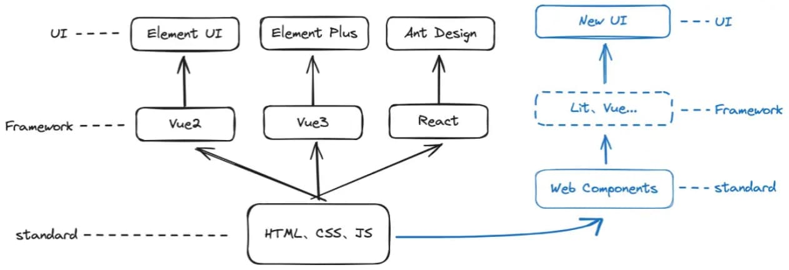
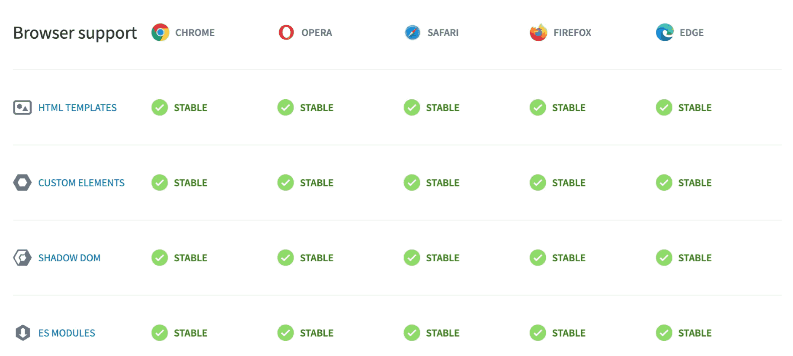

## 前言

::: info 前言

本篇文章让你多方位了解 Web Components，但不涉及任何技术细节的讲解。具体的 API 细节可留意后续文章~

:::

## 开始学习

::: info 一句话概括！

Web Components 是一组 Web 平台 API，运用它们可以创建可重用的定制元素，这些定制元素可在现代浏览器上运行，并且可以与任何支持 HTML 的 JavaScript 库或框架一起使用。

::: warning 言简意赅

Web Components 是可以直接被浏览器渲染的自定义组件 。

:::

::: info 为什么要学?

现阶段前端编写 UI 的方向是组件化，像 `Vue & React` 都是属于组件化的框架。但是它们都依赖于框架本身和构建工具。

举个例子，基于 `Vue` 的 `Element` 只能用于基于 Vue 的项目，基于 `React` 的 `Ant Design` 只能用于基于 React 的项目，这类型的 UI 库是不能混用的，原因就是它们都依赖于框架本身和构建工具（`Webpack` 和 `Vite` 等）提供的对组件的运行时和编译构建能力。

换句话说就是：`Vue`只认识 Element 组件语法，`React`只认识 `Ant Design`组件语法。

甚至更严格一点，同一框架不同版本之间也可能不兼容：**Vue2 只认识 Element UI 的组件语法，Vue3 只认识 Element Plus 组件的语法。**

而 Web Components 的出现可以打破这种局面。因为 Web Components 是原生支持的，理论上可以实现无框架、无编译的组件库。如果有一套组件库是基于 Web Components 技术开发的，那么就可以运用到任意 Web 项目，自然也包括 Vue2 & Vue3 & React 等 Web 框架

:::

## 是不是很酷

::: info WebComponents

因为 Web Components 是原生支持的，如果有一套组件库是基于 Web Components 技术开发的，那么就可以运用到任意 Web 项目，自然也包括 Vue & React 等 Web 框架

::: warning 听上去是不是很酷？

往往这种 `「统一的」`有利于大家 `「偷懒」`的技术都会得到不错的发展。并且目前 HTML 和 DOM 规范中已添加了支持 Web Components 的功能，其中当属 Chromium 内核的浏览器支持的最好。

:::

## 浏览器支持

*截止目前 2024 年 7 月 4 日*

::: info 浏览器支持

Web Components 包含 4 个部分：`HTML Template`、`Custom Elements`、`Shadow DOM` 和 `ES Modules`。

下图是官方给出的主流浏览器对这 4 部分的支持情况：

可以看到已经支持的非常完善了，状态全部都是 `STABLE`

如果遇见某些浏览器不支持部分功能怎么办？比如 `IE 11` ?!!，这时候我们可以采用 [Web Components Polyfills](https://github.com/webcomponents/polyfills "https://github.com/webcomponents/polyfills")。

不过，除非情况特殊，我们一般都不要去考虑兼容不支持的浏览器。

:::

## 行业使用情况

*检索了部分，远不止这些*

::: details Twitter

Twitter 2016 年开始将自己的嵌入式推文从 `iframe` 切换成 Web Components 中的 `Shadow DOM` 技术。从而使浏览器内存占用率大幅降低，渲染时间大幅缩短，推文显示速度更快，页面滚动更流畅。

[Upcoming Change to Embedded Tweet Display on Web](https://devcommunity.x.com/t/upcoming-change-to-embedded-tweet-display-on-web/66215 "https://devcommunity.x.com/t/upcoming-change-to-embedded-tweet-display-on-web/66215")

:::

::: details Google

Google 开源了许多 Web Components，包括地图、Drive、日历等。也包括 Google 系产品 Youtube 的播放器组件。

[GitHub - GoogleWebComponents](https://github.com/GoogleWebComponents)

:::

::: details Microsoft Corporation

Microsoft Corporation(微软)使用基于 Web Components 技术开发的组件库 [FAST](https://github.com/microsoft/fast "https://github.com/microsoft/fast") 重构了 [MSN](https://www.msn.cn/zh-cn "https://www.msn.cn/zh-cn") 网站。另外，基于 ChatGPT 的 New Bing 也是基于 FAST 构建的。

:::

## 开源生态

*检索了部分，远不止这些*

::: info 开源生态

* [Lit](https://github.com/lit/lit "https://github.com/lit/lit")：Google 开源的一个用于构建快速、轻量级 Web 组件的简单库
* [Fast](https://github.com/microsoft/fast "https://github.com/microsoft/fast")：微软 Edge 团队开源的基于 Web Components 技术的组件库
* [Stencil](https://github.com/ionic-team/stencil "https://github.com/ionic-team/stencil")：Ionic 团队开源的 一个 Web Components 编译器
* [Omi](https://github.com/Tencent/omi "https://github.com/Tencent/omi")：腾讯开源的一个 Web Components 框架

::: warning 开源生态

和现在主流 Web 框架结合呢？通过 [Custom Elements Everywhere](https://custom-elements-everywhere.com "https://custom-elements-everywhere.com") 网站可以得知一些数据：

* `React 18.2.0` 测试分数为 `67%`
* `React 19 Beta` 测试分数为 `100%`
* `Vue 3.2.38` 测试分数为 `100%`
* `Angular 16.2.10` 测试分数为 `100%`
* `Svelte 3.59.2` 测试分数为 `94%`

也就是说，主流框架对其的支持程度都还是不错！

:::

## 未来如何？

::: info 未来

虽然 Web Components 这东西是一套标准/规范，但正是由于它是一套标准/规范，导致它发展会比第三方框架慢。就是说大家熟知的 Vue & React 等框架正如日中天的时候，Web Components 可能才刚刚起步。

 **我个人的看法则是 Web Components 会和第三方框架一起发展，但是它将长期甚至一直落后于「流行的第三方方案」** 。这里我说的第三方框架包含但不限于 Vue & React 等框架，还包含未来可能新出的一些框架。

「标准」落后于「第三方」这种事在前端并不少见，和大家比较贴近的比如 CSS & Sass/Less。

由于这种落后的现象存在，而应用层面我们追求的往往又是 `「在可行的方案上最大程度的提高生产力」`，所以即便是 Web Components 大成，可能也是充当一门 `「基础技术」`服务于更上层的框架。

所以，当别的文章在用 `Web Components` vs `Vue & React` 时，可能就已经错了。 真正横向对比的应该是 `基于 Web Components 的 xxx` vs `Vue & React`

最后，引用一句来自用户 [rccoder](https://github.com/rccoder "https://github.com/rccoder") 的评论来结束本文：

> 未来会如何？永远是个谜。我选择站在 JS 的船上等待未来黎明的到来。

:::

## 参考文章

*部分内容参考以下文章 & 讨论*

* [你不知道的 Web Components - 现状](https://www.albertaz.com/blog/web-components-ststus "https://www.albertaz.com/blog/web-components-ststus")
* [Web Component 和类 React、Angular、Vue 组件化技术谁会成为未来？](https://www.zhihu.com/question/58731753 "https://www.zhihu.com/question/58731753")
* [精读《Web Components 的困境》](https://github.com/ascoders/weekly/blob/master/%E5%89%8D%E6%B2%BF%E6%8A%80%E6%9C%AF/10.%E7%B2%BE%E8%AF%BB%E3%80%8AWeb%20Components%20%E7%9A%84%E5%9B%B0%E5%A2%83%E3%80%8B.md "https://github.com/ascoders/weekly/blob/master/%E5%89%8D%E6%B2%BF%E6%8A%80%E6%9C%AF/10.%E7%B2%BE%E8%AF%BB%E3%80%8AWeb%20Components%20%E7%9A%84%E5%9B%B0%E5%A2%83%E3%80%8B.md")
* [2023 State of Web Components](https://eisenbergeffect.medium.com/2023-state-of-web-components-c8feb21d4f16 "https://eisenbergeffect.medium.com/2023-state-of-web-components-c8feb21d4f16")

## End
