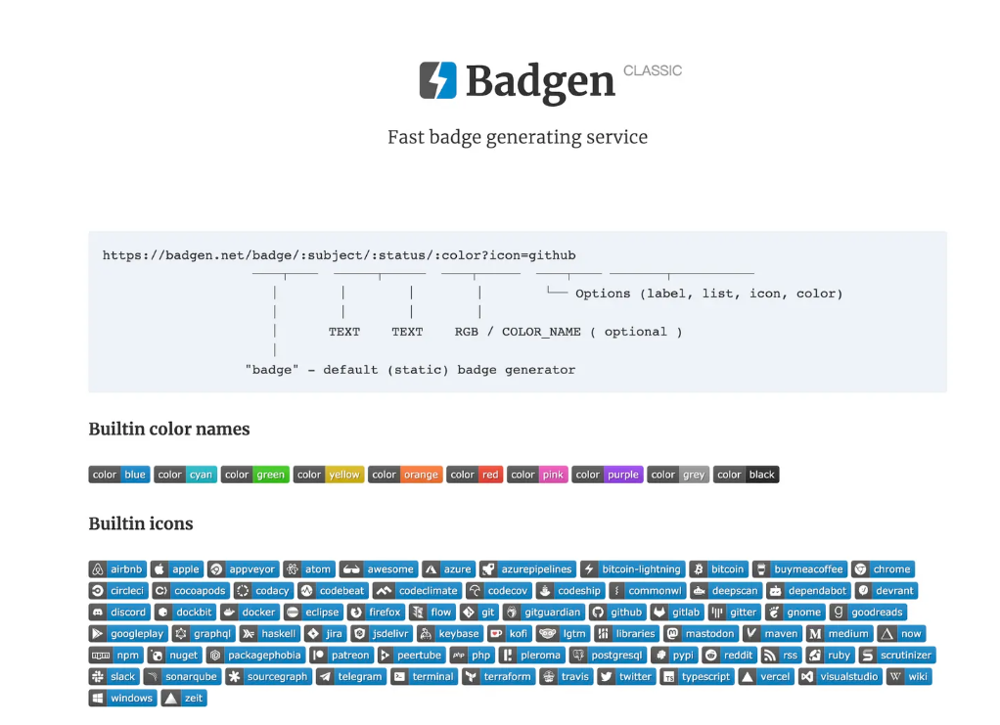

## Badgen介绍

网址：[Badgen.net ](https://badgen.net/help#colors)

快速生成徽章的服务。

## 参考文档

* [GitHub 项目徽章的添加和设置](https://juejin.cn/post/6844903529627254798#heading-10)
* [shields给项目添加github徽章](https://blog.csdn.net/mouday/article/details/82804630)
* [为你的Github README生成漂亮的徽章和进度条](https://shikieiki.github.io/2017/03/01/%E4%B8%BA%E4%BD%A0%E7%9A%84Github%E7%94%9F%E6%88%90%E6%BC%82%E4%BA%AE%E7%9A%84%E5%BE%BD%E7%AB%A0%E5%92%8C%E8%BF%9B%E5%BA%A6%E6%9D%A1/)
* [github.com/igrigorik/ga-beacon](https://github.com/igrigorik/ga-beacon)
* [github.com/boennemann/badges](https://github.com/boennemann/badges)
* [ellerbrock.github.io/open-source-badges/](https://ellerbrock.github.io/open-source-badges/)

---
