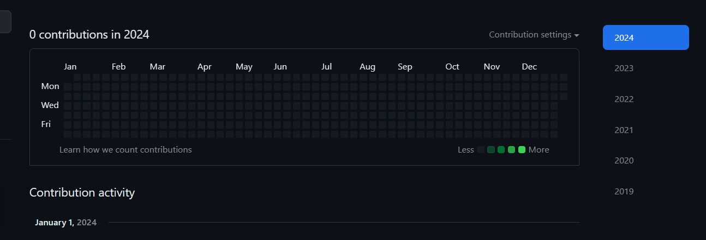
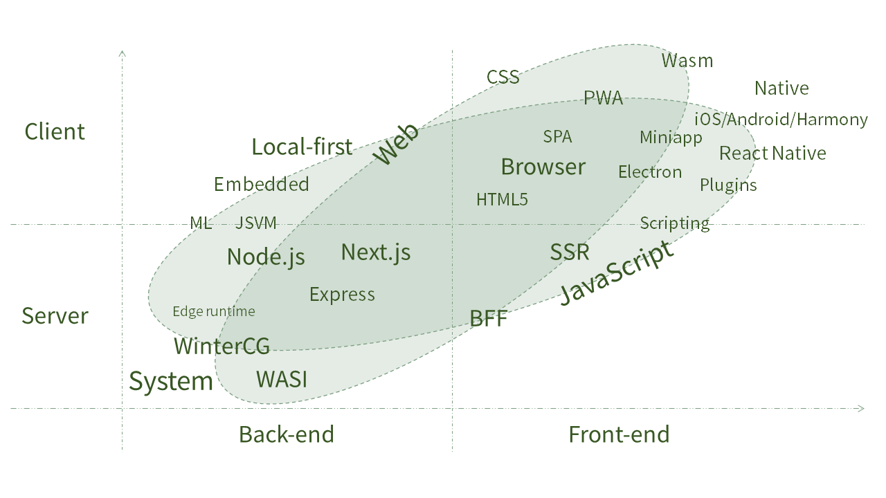

## 再见，2023

地球online2023赛季即将结束，请各位玩家做好存档记录，服务器将在23:59:59，进行服务器不维护更新，赛季为地球online2024，祝各位新的赛季，一切顺利 ! 再见~~2023~~ ！😎

## 你好，2024

时间如白驹过隙，一眨眼，2023已经到了最后一站，[Github](https://github.com/yaozongbin?tab=overview&from=2024-01-01&to=2024-01-01)也更新了2024的贡献工作表🔗

在2024年的今天，相信前端早已不局限于对着组件库撸后台curd，随着互联网行业的收紧，各大公司对前端的要求也越来越高，请热爱前端行业的朋友不要气馁，前端还可以做很多事。曾经业界还对 `Typescript`抱有观望态度，而现在几乎已经成为了前端基石。在2024年之后，个人认为服务端渲染框架将成为必备技能。

前端仍然有很多可以深挖的细分领域，比如 `webgl`、`Fultter`、`Rust`等，但是这些领域较窄，能提供的岗位有限，需要认定之后去深入研究，比较吃长期积累。

## 守正

“持中守正，方可行稳致远”，保持对底层原理的探索与思考，才能守道之法而行术之器。举个例子，对JavaScript语言本身的探究就较之实现一个页面逻辑本身来的重要，当内修固稳之后才能形成质的飞跃，内固而外化，厚积而薄发，而内功心法的修炼往往却十分枯燥难以坚持。所以，“仰之弥高，钻之弥坚”，内核强大才能催动外物的延展。

## 出新

“知常明变者赢，守正出新者进”，大环境的变化也催化了整个前端走向的变化，近几年以来前端业界大部分的出新大体都来自其他领域的延展融合。为了更好的适应当下的变化，前端工程师不能仅仅局限于本身工作范畴而不去拓展新的边界。个人认为，未来几年一定会朝着更加整合多元的趋势发展，一专多能、具备“特种化作战能力”的前端才是真正意义上的现代化前端。一个前端如果只会前端，那也成不了最好的前端，想要能够高效拓展自己的边界则正需要源于“守正”沉淀下来的内核系统而带来的无限放大。故，“凡战者，以正合，以奇胜”，抱朴守拙才能推陈出新。

## 2024目标

::: warning 技术方面
希望你能够保持现有你已经学会的技术不落下,并且在其中有几个可以突破-下,并且学习-门新的语言或很流行的技术，当然更重要的是学习这些技术的思想,技术会过时，但是思想不会。
:::

::: warning 学习方面

自律、认真、合理分配时间、拿下绩点、顺利毕业！

:::

::: info 生活方面

希望身体至少不必现在差，还是要坚持锻炼,也要开心过好每一天, 以后或许会很艰难，道路很坎坷，成年人的世界没有容易二字,但是无论发生了什么事情，也不要放弃!

:::

::: info 工作方面

希望能成为一名合格的前端开发工程师！！

:::

## 总结

::: details 总结

**守正持中，致远出新**

**知常明变，合正奇出**

**工程锈化，边缘运行**

**多端编译，智能叠加**

**互动分化，微件组合**

**动静展现，渲染多光**

**因势利导，转石于山**

**前端不死，未来可期**

:::

2024已来，愿各位前端开发者在新的一年里慎思明辨、致远笃行，与君共勉！
