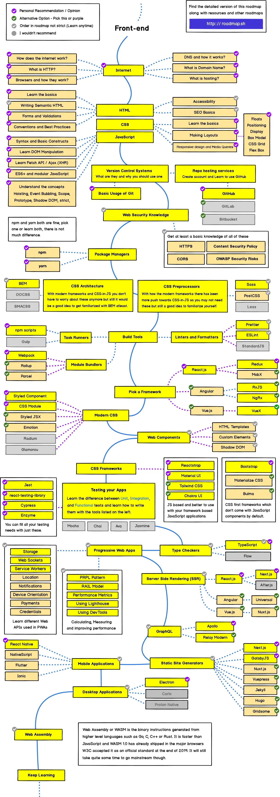

## 前言

在 GitHub 看到一个很不错的[前端学习路线图](https://github.com/kamranahmedse/developer-roadmap "https://github.com/kamranahmedse/developer-roadmap")（roadmap），从前端基础到前端工程化，再到跨端，都有知识点的覆盖，非常推荐阅读。[通过对前端知识进行一个评级，确定现在阶段，然后提供清晰的学习路线，完成进阶。](https://yaozongbin.gitee.io/yaozongbin/docs/frontend/frontend.html)



### 计算机网络

 

掌握计算机网络的基础是一名前端工程师的基本素养，建议先学习以下的知识

1. Internet 如何工作
2. HTTP协议
3. 浏览器工作机制
4. DNS 及其运行机制
5. 了解域名、网站托管

### HTML


1. 学习 HTML 基础，标签、元素、表单验证等等
2. 语义化标签
3. 了解 Web 无障碍（Accessibility）
4. 学习 SEO 优化

### CSS


1. 学习 CSS 基础
2. 制作布局：浮动、定位、显示、盒模型、网格布局、弹性布局
3. 响应式设计和媒体查询（@media）
4. 结合 HTML 制作一个简单的网页作为最佳实践

### JavaScript


1. 学习语法和基本结构
2. 学习操作 DOM
3. 学习 Fetch API / Ajax（XHR）
4. ES6+ 和模块化 JavaScript
5. 了解变量提升、事件冒泡机制、作用域、原型、Shadow DOM、严格模式等概念

### 版本控制


1. Git 的基本操作
2. 创建账号并且学习使用 GitHub
3. 创建账号并且学习使用 Gitee

### Web安全知识


1. HTTPS
2. 内容安全策略（CSP）
3. 跨域资源共享
4. OWASP 安全风险

上面的内容是前端最基础的部分，建议多花时间，掌握好每一个知识点。

---

从这开始，将进入前端工程化的部分，你可能会接触到很多种不同的框架，并学习使用多种的工具为自己的开发提效。

### 包管理工具

|  |  |  |
| --------------------------------------------------- | ------------------------------------------------------------------- | ------------------------------------------------------------------- |

npm 、yarn和pnpm 三者都很好，选择一个学习即可，他们仨是相似的

1. npm
2. yarn
3. pnpm

### CSS 构架

通过使用现代的 CSS 框架和 CSS-in-JS 的书写方式，不用再担心 CSS 的构架问题，但熟悉 BEM 规范是一个不错的选择。

1. BEM，一种书写规范
2. OOCSS
3. SMACSS

### CSS预处理器

|  |  |  |
| ------------------------------------------------------------------- | ---------------------------------------------------------------------------- | ------------------------------------------------------------------- |

以下三选一进行学习即可。

1. Sass
2. PostCSS
3. Less

### 构建工具

* 任务执行器

```bash
 npm scripts ✔︎ 
 Gulp ✘
```

* 代码检查和格式化工具

```bash
 Prettier 代码格式化 ✔︎
 ESLint 代码检查 ✔︎
 StandardJS ✘
```

* 模块打包

```bash
 Webpack ✔︎
 Rollup ✔︎
 Parcel ✔︎
```

### 前端框架

|  |  |  |
| ------------------------------------------------------------------- | ----------------------------------------------------------------------- | ------------------------------------------------------------------------------------------- |

前端框架推荐先学习 Vue ，特点是上手快，中文文档齐全，可以选择性的学习。

1. [Vue.js](https://cn.vuejs.org/)
2. [React.js](https://react.docschina.org/)
3. [Angular](https://angular.cn/)

### 现代 CSS

1. Styled Component ✔︎
2. CSS Module ✔︎
3. Styled JSX ✔︎
4. Emotion ✔︎
5. Radium ✘
6. Glamorou ✘

### Web 组件

1. HTML 模版 ✔︎
2. 自定义元素 ✔︎
3. Shadow DOM ✔︎

### CSS 框架

CSS 框架有两种，一种是基于 JavaScript 框架开发的应用程序。推荐的框架有：

1. Reactstrap ✔︎
2. Material UI ✔︎
3. TailWind CSS ✔︎
4. Chakra UI ✔︎

另外一只是纯 CSS 框架，默认和不和 JavaScript 组件一起使用。

1. BootStrap ✔︎
2. Materialize CSS ✔︎
3. Bulma ✔︎

### 测试

在这里你需要学习使用下面的框架进行单元、集成和功能测试。

1. Jest ✔︎
2. react-testing-library ✔︎
3. Cypress ✔︎
4. Enzyme ✔︎

### 类型检查器

1. TypeScript ✔︎
2. Flow ✘

---

上面是前端工程化的学习内容，接下来的内容涉及到性能、服务端渲染以及跨端，这一部分前端也叫被称作「**大前端**」。

### PWA

1. 学习 PWA 中使用到的 Web API：

   * Storage
   * Web Sockets
   * Service Workers
   * 定位
   * 通知
   * 设备方向
   * 支付、证书等等
2. 计算、测量以及提高性能：

   * PRPL 模式
   * RAIL 模式
   * 性能指标
   * 学习使用 LightHouse
   * 学习使用 DevTools

### 服务端渲染

1. Next.js （React.js）
2. Nuxt.js （Vue.js）
3. Universal（Angular）

### GraphQL

1. Apollo
2. Relay Modern

### 静态网站生成

|  |  |  |  |  |  |  |
| ---------------------------------------------------------------------- | ------------------------------------------------------------------------------------------ | ---------------------------------------------------------------------- | -------------------------------------------------------------------------- | ------------------------------------------------------------------------------------ | ------------------------------------------------------------------ | ------------------------------------------------------------------- |

1. Next.js
2. GatsbyJS
3. Nuxt.js
4. Vuepress
5. JekyII
6. Hexo
7. Hugo

### 移动端应用开发

1. ReactNative
2. Flutter
3. uniapp

### 桌面应用开发

1. Electron
2. Carlo
3. Proton Native

### WebAssembly


---

总结完毕，不由得感叹前端生态真是丰富多彩，要学的东西很多，自己不懂的也很多，有些知识点也是浅尝辄止。虽然有这么多的方向，但还是需要找到一个点能够深挖。如果你是前端的初学者，也不要被这些框架给吓到，学好基础然后加以实践更为重要。上面推荐的 [Roadmap GitHub ](https://github.com/kamranahmedse/developer-roadmap)仓库里也有后端以及 DevOps 的学习路线，可以自行浏览.，如果你也喜欢[前端](https://yaozongbin.gitee.io/yaozongbin/docs/frontend/frontend.html)，Keep Coding， 一起加油！
