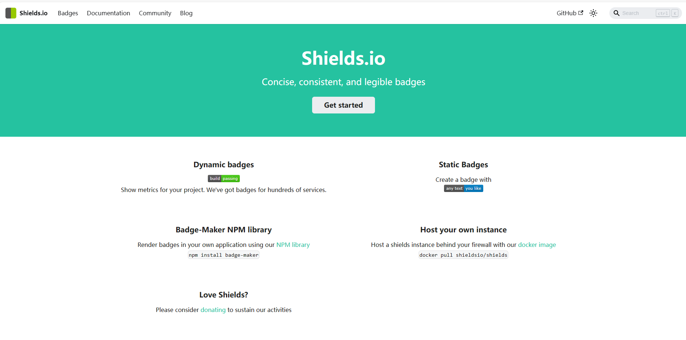
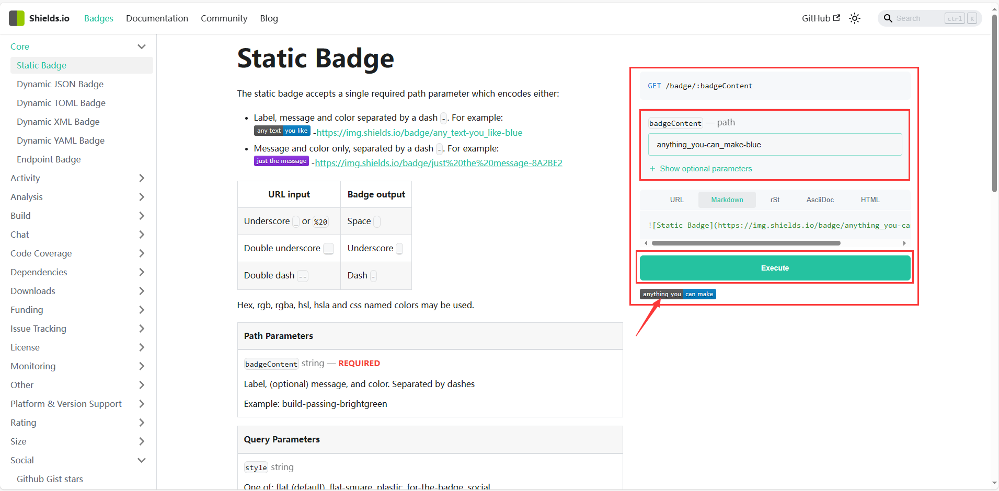
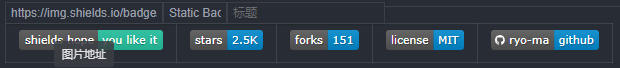

## Shields介绍

|  |  |  |  |  |
| ------------------------------------------------------------------------------ | ------------------------------------------------------------- | -------------------------------------------------------------------- | --------------------------------------------------------------- | ------------------------------------------------------------------------------ |

 [网址：shields](https://shields.io/)

Shields.io 提供SVG和光栅格式的简洁、一致、可读的徽章的服务，可以很容易地包含在GitHub readmes或任何其他网页中。该服务支持数十种持续集成服务、软件包注册、发行、应用商店、社交网络、代码覆盖服务和代码分析服务。每个月它提供超过8.7亿张图片，并被一些世界上最受欢迎的开源项目所使用，VS Code、Vue.js和Bootstrap就是其中的几个例子。[Shields_Github开源项目地址](https://github.com/ryo-ma/github-profile-trophy/)

具体用法：

复制[Markdown](https://shields.io/badges/static-badge)链接粘贴即可。

## 参考文档

* [GitHub 项目徽章的添加和设置](https://juejin.cn/post/6844903529627254798#heading-10)
* [shields给项目添加github徽章](https://blog.csdn.net/mouday/article/details/82804630)
* [为你的Github README生成漂亮的徽章和进度条](https://shikieiki.github.io/2017/03/01/%E4%B8%BA%E4%BD%A0%E7%9A%84Github%E7%94%9F%E6%88%90%E6%BC%82%E4%BA%AE%E7%9A%84%E5%BE%BD%E7%AB%A0%E5%92%8C%E8%BF%9B%E5%BA%A6%E6%9D%A1/)
* [github.com/igrigorik/ga-beacon](https://github.com/igrigorik/ga-beacon)
* [github.com/boennemann/badges](https://github.com/boennemann/badges)
* [ellerbrock.github.io/open-source-badges/](https://ellerbrock.github.io/open-source-badges/)

---
