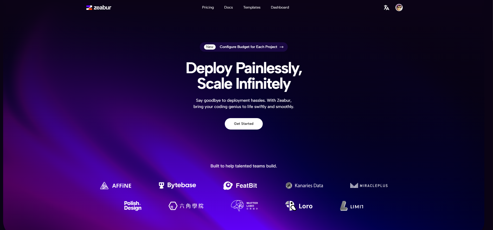
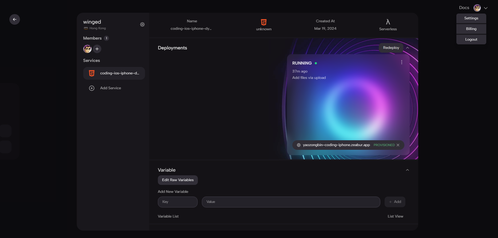
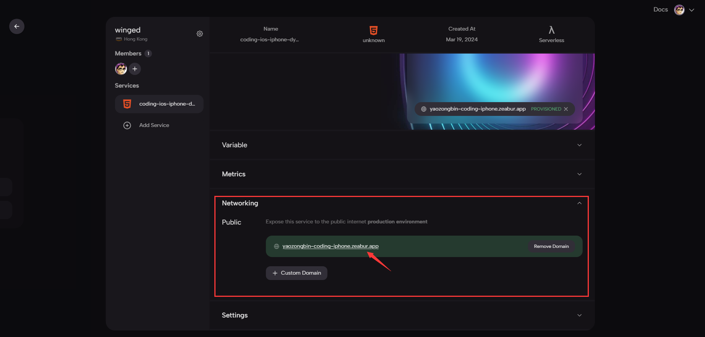
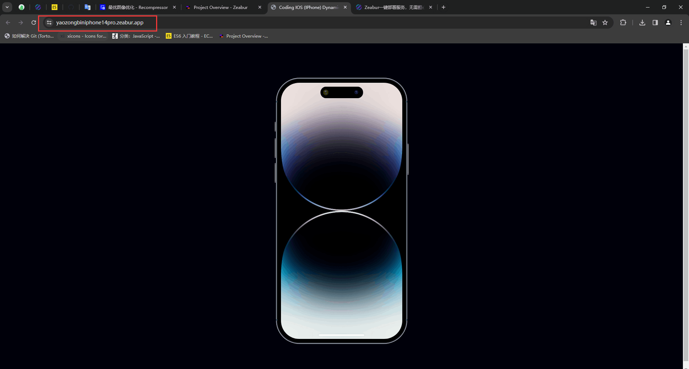

::: info 介绍

[Zeabur](https://zeabur.com/)是国内的学生团队搭建的产品，帮助开发者们能够一键部署的自己的各种服务而无需担心基础设施。
不同于 Vercel ，除了前端应用和 Serverless Function 之外，Zeabur 还可以部署各类后端服务以及数据库，搭配按量计费的收费模式，让开发者能最低负担地部署自己的产品。

::: warning 食用方法

选择Hong Kong服务器(国内访问快点)

绑定Github并创建新项目

 命名规则xxx.zeabur.app

部署成功，完美运行 [Coding IOS (IPhone) Dynamic Music](https://yaozongbiniphone14pro.zeabur.app/) 🔗

::: 

::: info Zeabur特点

#### 自动分析部署策略

Zeabur 能够根据项目代码来自动识别项目所使用的语言，框架或架构，为其自动选择最合适的部署策略，只需点击导入仓库，服务即可部署上线。

#### 按量计费

传统的部署需要租用服务器，为了服务的稳定性，往往会有很多浪费的资源，而 Zeabur 采用按量计费的模式，根据内存，流量和 CPU 使用量来按量收费，只收取实际用到的资源费用。

#### 一站式整合

对部署平台，大家最了解的应该是 Vercel ，而 Vercel 最大的缺点就在于它并不能满足开发者的所有需求，只能部署前端和无状态服务。而 Zeabur 能够部署包括前端，后端，数据库等各种服务，帮助你在一个平台部署好所有服务。

#### 其他功能

* 开箱即用的 CI/CD
* 弹性扩张资源
* 多环境管理
* 对象存储服务
* 域名管理
* 服务变量管理

::: danger 使用体验

目前平台处于使用期间，功能不够完善，且稳定性有待提高。

一周内在线率是 100%，未来可期。看文档价目表，

后期可能会有收费，但也是白嫖一天算一天。（主要还是白嫖的香哈哈哈）

站点生成速度明显快于 Vercel 等，应该是对 Hexo 等博客框架进行相关优化。

:::
