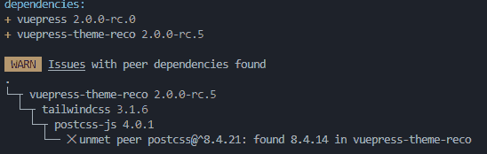
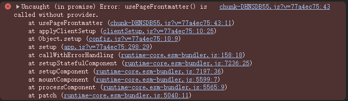
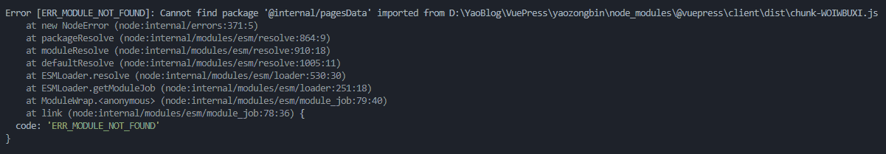
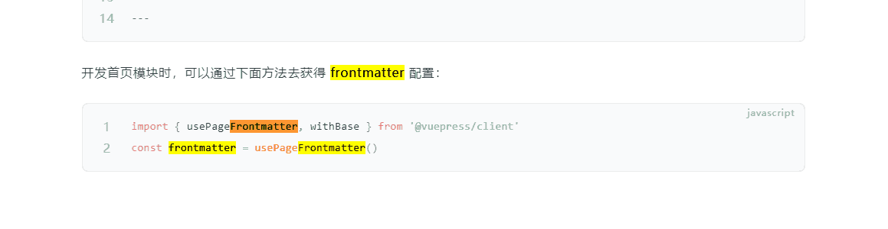
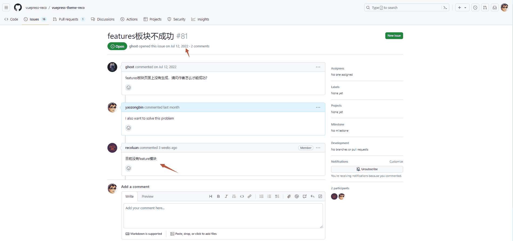
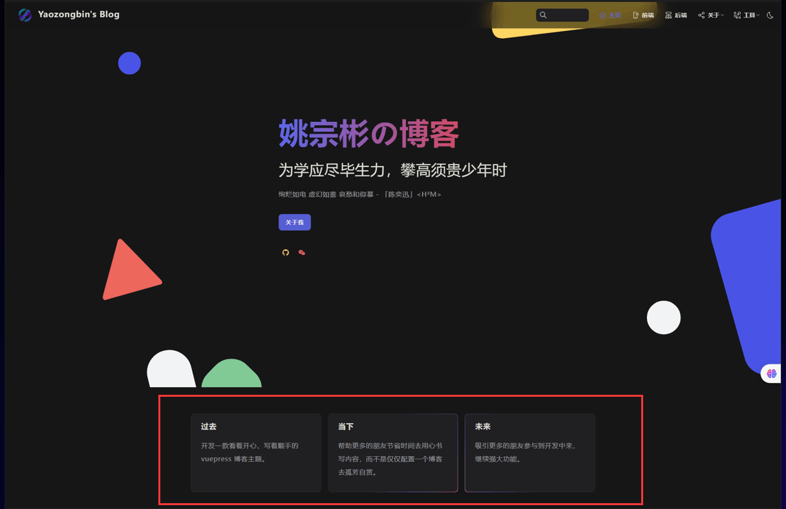
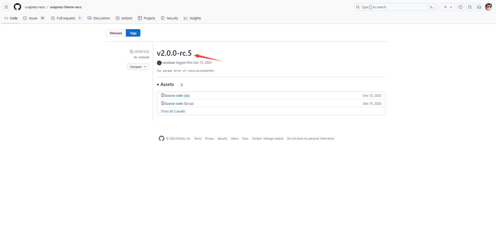

## 前言

::: info vuepress-theme-reco

基于`2022`年 `2.0.0-beta.68`版本的食用，自我感觉良好，目前更新到最新版本 `2.0.0-rc.5`版本，可目前新版本使用 `pnpm`作为包管理工具下载依赖，会出现一些依赖缺失的情况，导致运行后报错。当然作者已经向vuepress官方提了issue了，希望早日兼容 `pnpm`

:::

## 问题

::: info Bug

::: warning Solve

`pnpm`插件报错：我的电脑 `Node.js`版本 `v17.3.0` 插件可以正常安装，但是项目启动后，`pnpm`会出现依赖缺失的情况，我觉得是新版本目前还不支持 `pnpm`，过查看错误信息，定位是 `pnpm`的依赖文件 `git`不成功。目前是通过 `npm`来安装依赖解决问题。

:::

## 更新

::: info Update

2022年的 `issues`终于被作者解决了😂

2024年 `Features`模块终于可以使用了！！

:::

## 总结

::: warning Summarize

`2.0.0-rc.5` 版本确实不错，美中不足的就是暂时还不支持 `pnpm`安装依赖，希望早日修复此 `Bug 🦂`

:::

## 相关链接

* [vuepress-theme-reco.recoluan](https://vuepress-theme-reco.recoluan.com/)
