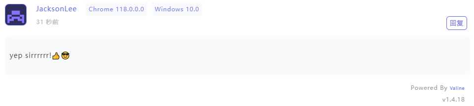
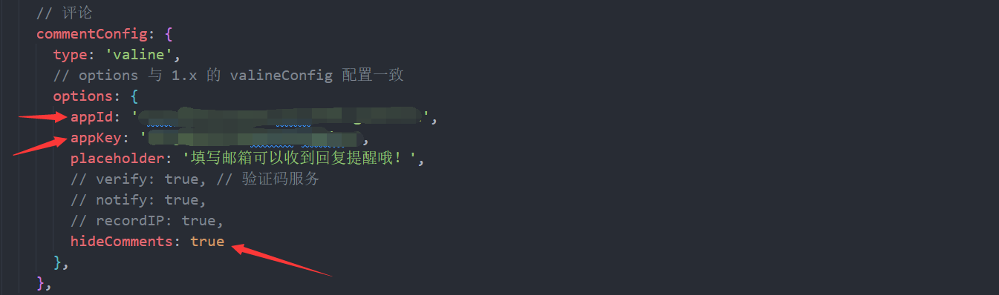
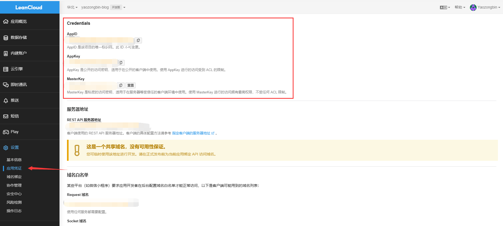
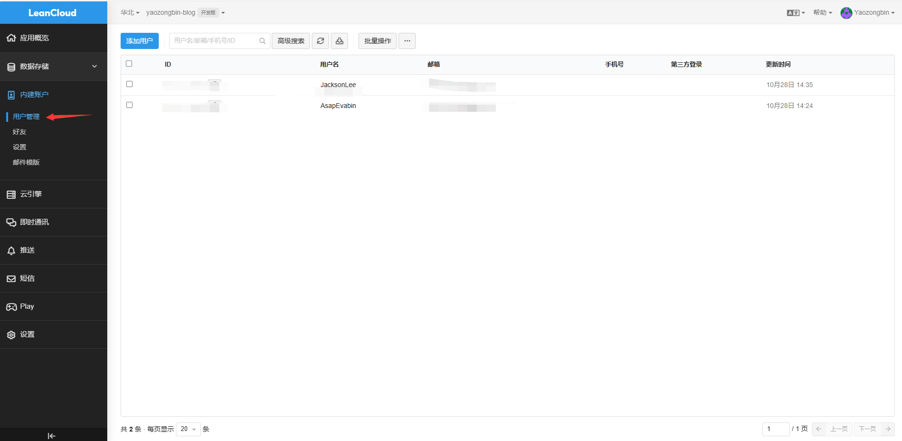

## 介绍

vuepress-reco主题内置评论插件 `@vuepress-reco/vuepress-plugin-comments`，目前支持 `Valine、Waline、Giscus`；

如果你想默认不加载评论，而只在某些页面显示评论功能，可以在 `commentConfig.options` 中设置 `hideComments: true`，并在需要展示评论的页面设置 `hideComments: false`。

如果仅是某篇文章不想设置开启评论功能，可以在 `front-matter` 设置 `hideComments: true`。



## Option API

### Valine

```js
// .vuepress/config.ts

import { defineUserConfig } from 'vuepress'
import { recoTheme } from 'vuepress-theme-reco'

export default defineUserConfig({
  theme: recoTheme({
    commentConfig: {
      type: 'valine',
      options: {
        appId: '...', // your appId
        appKey: '...', // your appKey
        hideComments: true, // 全局隐藏评论，默认 false
      },
    },
  }),
})
```

具体可以查看[Valine官网](https://valine.js.org/configuration.html)。

### Waline

```js
// .vuepress/config.ts

import { defineUserConfig } from 'vuepress'
import { recoTheme } from 'vuepress-theme-reco'

export default defineUserConfig({
  theme: recoTheme({
    commentConfig: {
      type: 'waline',
      options: {
        serverURL: 'your serverURL',
        ...
        hideComments: true, // 全局隐藏评论，默认 false
      },
    },
  }),
})
```

使用教程及 options 其它参数参考 [Waline 官网](https://waline.js.org/guide/get-started.html)。

### Giscus

```js
// .vuepress/config.ts

import { defineUserConfig } from 'vuepress'
import { recoTheme } from 'vuepress-theme-reco'

export default defineUserConfig({
  theme: recoTheme({
    commentConfig: {
      type: 'giscus',
      options: {
        repo: 'reco/blog-comments',
        repoId: 'R_kgDOxxxxxx',
        category: 'Announcements',
        categoryId: 'xxxxx',
        mapping: 'title',
        ...
        hideComments: true, // 全局隐藏评论，默认 false
      },
    },
  }),
})
```

使用教程及 options 其它参数参考[Giscusopen](https://giscus.app/)。

## 使用

这里我选择的是 [Valine](https://valine.js.org/configuration.html) ，你需要配合 [Leancloud](https://www.leancloud.cn/) 来获取你的appID合appKey。





如需查看评论数据可以去[Leancloud](https://www.leancloud.cn/)控制台查看数据信息。



---
