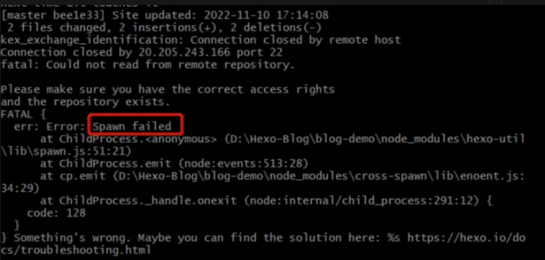
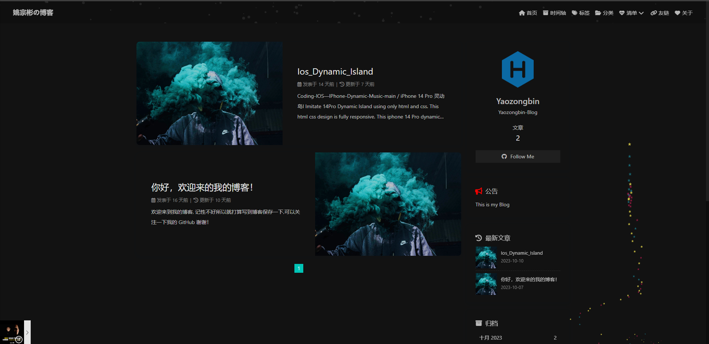

---
title: Hexo 从零开始搭建自己的博客网站
date: 2023/10/24
tags:
 - Hexo
categories:
 - 前端
hideComments: false
---
## 1.前言

::: info Preface

基于vuepress的搭建，相信大家应该对博客搭建有所了解了 ,话不多说直接开造!

:::

## 2. 创建 GitHub 仓库并配置ssh

登录你的 GitHub 帐号，并创建一个新的仓库，仓库名是 `<username>.github.io`，其中 `<username>` 是你的 GitHub 用户名。将该仓库设置为公开仓库。 设置ssh

```apache
ssh-keygen -t rsa -C 'xxx@xxx.com'  #自己的邮箱
cat ~/.ssh/id_rsa.pub  #将里面的内容复制到 github ->settings ->SSH and GPC keys ->SSH keys ->New SSH key中
ssh -T git@github.com  #输入yes之后，行末尾会显示你的用户名（绑定成功邮箱会收到邮件提醒）
#接着在本地绑定与Github的用户名和邮箱（git）
git config --global user.name "<username>"    #自己的用户名
git config --global user.email 'xxx@xxx.com'  #自己的邮箱
```

## 3.初始化Hexo

创建一个新的文件夹，用于存储你的博客项目。 在终端中，进入该文件夹，并运行以下命令来初始化 Hexo

```apache
mkdir myblog
hexo init  
#或者直接一步到位 
hexo init myblog
```

## 4.配置Hexo

* 进入你的 Hexo 项目文件夹，找到 _config.yml 文件，使用文本编辑器打开它。
* 在 _config.yml 文件中，配置你的博客设置，例如标题、描述、作者等。
* 根据需要，你还可以配置主题、插件和其他 Hexo 选项。
  编辑_config.yml文件，添加如下内容

```apache
deploy:
        type: git
        repo: git@github.com: <username>/ <username>.github.io.git  #<username>为自己的用户名
        branch: main
```

```
# 安装 hexo-deployer-git 插件 将部署过程自动化
npm install hexo-deployer-git
```

## 5.创建博客内容

在终端中，运行以下命令来创建新的博客文章：

```apache
hexo new "My First Post"
```

这将在 Hexo 项目的 source/_posts 目录下创建一个新的 Markdown 文件，用于编写你的第一篇博客文章。

## 6.部署

```apache
# 预览
hexo s  
# 清除静态文件
hexo clean
# 生成静态网站文件
hexo g 
# 将生成的静态网站文件部署到github
hexo d 
# 执行顺序
hexo clean -> hexo g -> hexo 
```


::: danger Bug

命令hexo d 后出现 Spawn failed问题出现此情况，大多原因是网络问题，可多尝试几次，实在解决不了可点击此链接: [Spawn failed](https://www.baidu.com/s?ie=utf-8&f=8&rsv_bp=1&rsv_idx=1&tn=baidu&wd=Spawn%20failed&fenlei=256&rsv_pq=0xd9cd80aa000e1a81&rsv_t=e127EJA5B+AEec/pKMyxnNJO7qtgtToFXaT0oWzOFZDoWquYMaLZDn99rQC/&rqlang=en&rsv_enter=1&rsv_dl=tb&rsv_sug3=31&rsv_sug1=25&rsv_sug7=101&rsv_sug2=0&rsv_btype=i&inputT=13983&rsv_sug4=14793 "https://vuepress-theme-reco.recoluan.com/")

:::


## 7.查看

浏览器打开 `<username>.github.io`即可查看

## 8.选择Hexo主题

::: details selectHexoTheme

[连背景都是特效的博客_preccrepad](https://preccrepad.github.io/)

[番茄博客_tomotoes](https://tomotoes.com/blog/)

[干净清爽系列主题_esappear](https://esappear.github.io/clover/)

[二次元系列主题_shoka](https://shoka.lostyu.me/)

[yilia升级版简洁型博客_joeybling](https://joeybling.github.io/)

:::



---
