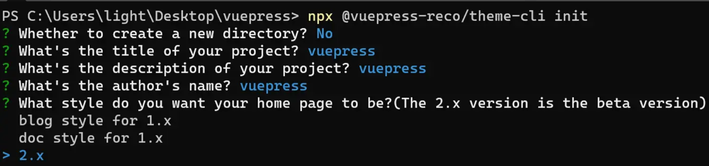
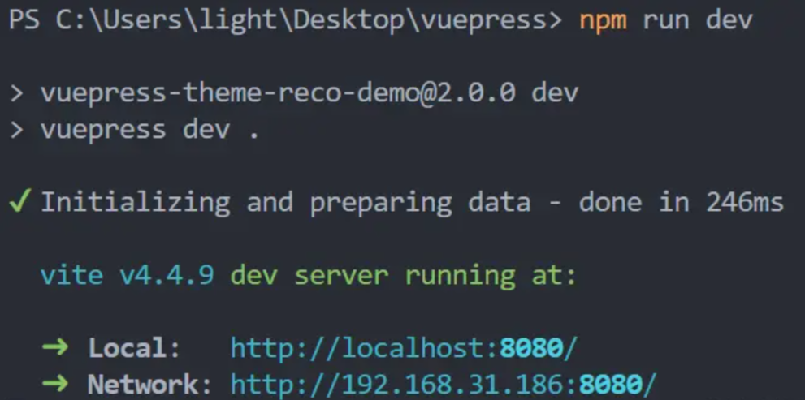
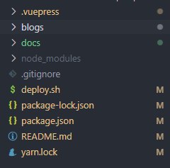
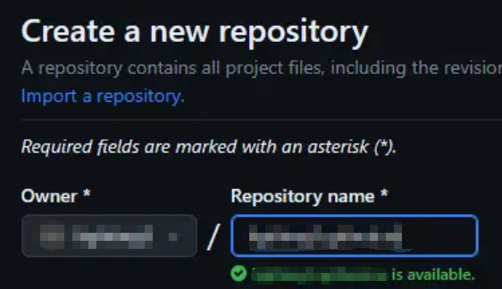
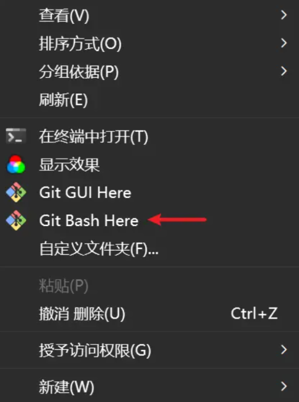
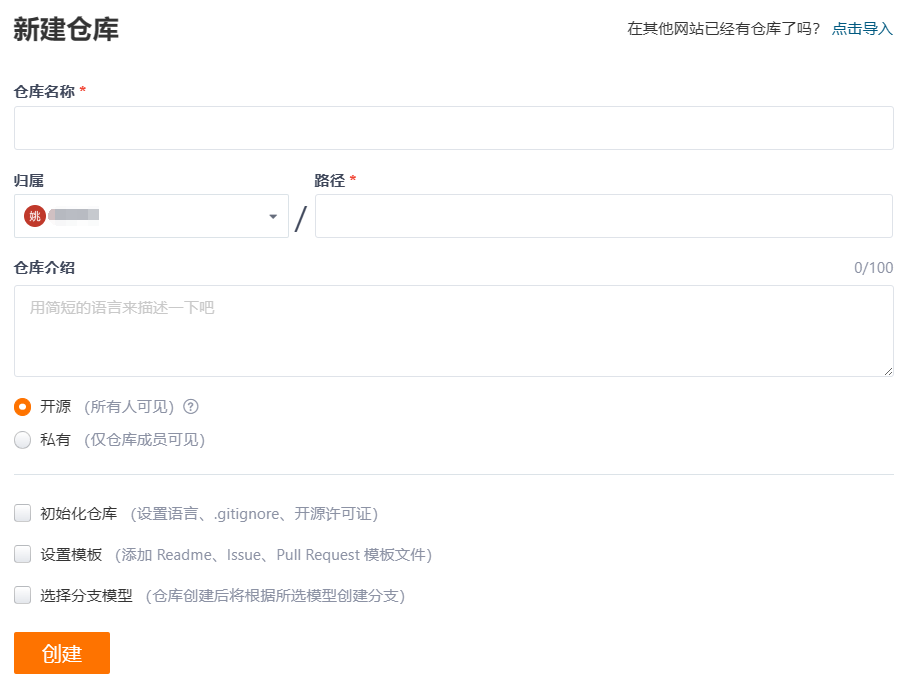
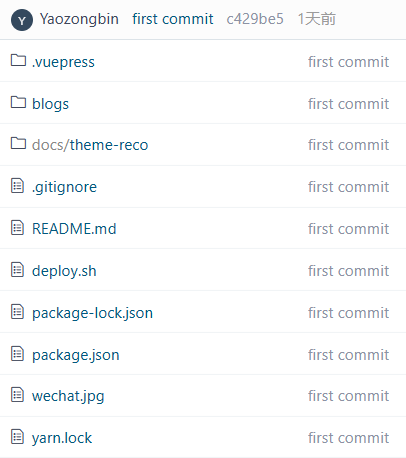
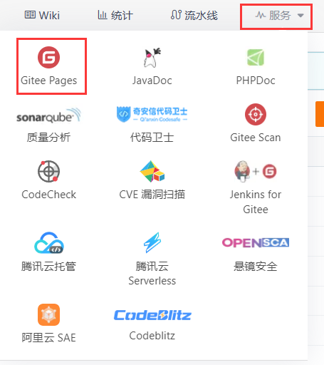
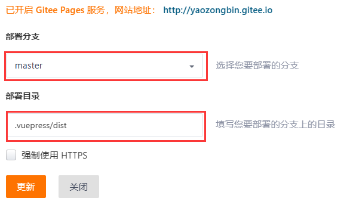

|                                                                                             |                                                                                                                |                                                                                                                                                                                                                                                                                                                                                                                                                                                     |  |
| :----------------------------------------------------------------------------------------------------------------------------------------------------------------- | ---------------------------------------------------------------------------------------------------------------------------------------------------------------------------- | --------------------------------------------------------------------------------------------------------------------------------------------------------------------------------------------------------------------------------------------------------------------------------------------------------------------------------------------------------------------------------------------------------------------------------------------------------------------------------------------------------- | - |
|                                                                                         |                                                                                                         |                                                                                                                                                                                                                                                                                                                                                                                                                                      |  |
|                                                                                        |                                                                                                  |  |  |
| [](https://www.npmjs.com/package/@vuepress/client "@vuepress/client") | [](https://www.npmjs.com/package/@vuepress/markdown "@vuepress/markdown") |                                                                                                                                                                                                                                                                                                                                                                                                                                        |  |

## 1.前言

::: info Preface

有自己的一个博客网站，不仅可以记录自己的学习笔记，分享自己的技术文章，还可以和志同道合的开发者交流，何乐而不为呢？
那么如何简单高效diy一个自己的博客网站呢？VuePress 就是一款非常优秀的静态网站生成器，它基于 [Vue](https://cn.vuejs.org/ "Vue") 构建，以 [Markdown ](https://markdown.com.cn/basic-syntax/)为中心的项目结构，以最少的配置帮助你专注于写作。
简单来说，只要你配置好项目后，就可以直接写 [Markdown ](https://markdown.com.cn/basic-syntax/)文档，然后生成静态网站，部署到[Github](https://github.com/yaozongbin)、[Gitee](https://gitee.com/yaozongbin)、[Coding](https://coding.net/)等静态网站托管平台，就可以直接访问了。

:::

## 2.技术选型

::: info TechnologySelection

这个是[vuepress官方文档链接](https://v2.vuepress.vuejs.org/zh/guide/)，兴趣深挖VuePress配置信息的同学可以过一遍文档。官方也给出了选择VuePress，而不是Nuxt、VitePress、GitBook等其他工具的理由。另外，如果是使用VuePress的默认主题的话，可能还是会让博客看起来比较单调，所以这里推荐使用[vuepress-theme-reco](https://vuepress-theme-reco.recoluan.com/ "https://vuepress-theme-reco.recoluan.com/")，一个基于 VuePress 2.x 的主题，这个主题插件看起来还是挺好看的，今天就以这个主题为例，来手把手教大家如何搭建一个属于自己的博客网站。

:::

## 3.安装配置

#### **npx**

```bash
# 初始化，并选择 2.x
npx @vuepress-reco/theme-cli init
```

---

#### npm

```bash
# 初始化，并选择 2.x
npm install @vuepress-reco/theme-cli@1.0.7 -g
theme-cli init
```

---

#### yarn

```bash
# 初始化，并选择 2.x
yarn global add @vuepress-reco/theme-cli@1.0.7
theme-cli init
```

---

这里我选择第一种方式:

* 先在D盘新建一个文件夹命名为vuepress；
* 进入vuepress文件夹，执行命令 `npx @vuepress-reco/theme-cli init` 选择2.x版本

  
* 用vscode打开项目， `npm install`安装依赖，然后 `npm run dev`启动项目，可以看到，项目是用vite来构建的。

  
* 自定义配置

  项目的文件目录如下：

  
* .vuepress 是vuepress的配置目录
* blogs 是放置博客目录
* docs 是放置文档目录

**README.md可以修改配置个人信息**

```markdown
home: true
modules:
  - BannerBrand
  - Blog
  - MdContent
  - Footer
bannerBrand:
  bgImage: '/bg.svg'
  title: xxxの博客
  description: ....
  tagline: 
  buttons:
    - { text: 关于我, link: '/blogs/Blog/2023/personal' }
    - { text: 前端, link: '/Frontend/', type: plain }   
    - { text: 后端, link: '/Backend/', type: plain }
  socialLinks:
    - { icon: 'LogoGithub', link: 'https://github.com/yaozongbin' }
    - { icon: 'LogoGitee', link: 'https://gitee.com/yaozongbin' }
blog:
  socialLinks:
    - { icon: 'LogoGithub', link: 'https://github.com/yaozongbin' }
    - { icon: 'LogoWechat' , link: '/docs/wechat' }
isShowTitleInHome: true
actionText: About
actionLink: /views/other/about
```

效果如下：


## 4.部署上线

基本上我们的博客已经搭建完成了，接下来就是部署上线了，可以使用[GIthub Pages](https://pages.github.com/) 或者 [Gitee Pages](https://gitee.com/yaozongbin/yaozongbin/pages)，免费让我们的博客上线。

##### Github

1. 首先new一个仓库，仓库名用你的用户名+github.io: `<USERNAME>.github.io`



> 如果你的[Github](https://github.com/yaozongbin)访问慢可以使用[Gitee](https://gitee.com/yaozongbin)来操作，[Gitee](https://gitee.com/yaozongbin)具体步骤在后面

2. 然后，将你的仓库克隆到本地，再将你的vuepress项目拷贝到仓库根目录下，然后将仓库推送到github的master主分支上。
3. 另外还需要创建另一个分支 `gh-pages`用来发布博客静态页面，可以在你的项目根目录下新建deploy.sh脚本，内容如下

```bash
# 确保脚本抛出遇到的错误
# set -e

# 生成静态文件
# npm run build

# 进入生成的文件夹
cd .vuepress/dist

git init
git add -A
git commit -m 'deploy'

# 如果发布到 https://<USERNAME>.github.io
# git push -f git@github.com:<USERNAME>/<USERNAME>.github.io.git master

# 如果发布到 https://<USERNAME>.github.io/<REPO> 或 https://<USERNAME>.gitee.io/<REPO>
# git push -f git@github.com:<USERNAME>/<USERNAME>.github.io.git master:gh-pages
# git push -f git@github.com:<USERNAME>/<USERNAME>.gitee.io.git master:gh-pages

# 我的配置如下
# git push -f https://gitee.com/yaozongbin/yaozongbin.gitee.io.git master:gh-pages

cd-

```

> 打开项目文件位置，右键用git bash执行deploy脚本，将本地项目推送到github的gh-pages分支



```bash
# 执行部署脚本
# sh deloy.sh
```

> 这样每次执行deploy脚本后，github的Actions会自动执行部署工作流，你的博客页面就会自动更新了。

##### Gitee

1. 同理new一个新的仓库，名称和用户名一致
2. 运行  `sh deploy.sh`  push到gitee仓库里然后打开服务，点击Gitee Pages    
3. 选择分支和部署目录
4. 成功部署

## 5.成功部署后,访问地址就是 `<USERNAME>.github.io`或 `<USERNAME>.gitee.io`

我的已经成功上线了，欢迎围观! 😎😍🤗🤩

  [yaozongbin.github.io](https://yaozongbin.github.io/yaozongbin/) / [yaozongbin.gitee.io](https://yaozongbin.gitee.io/yaozongbin/) / [yaozongbin.pages.dev](https://yaozongbin.pages.dev/)


---
