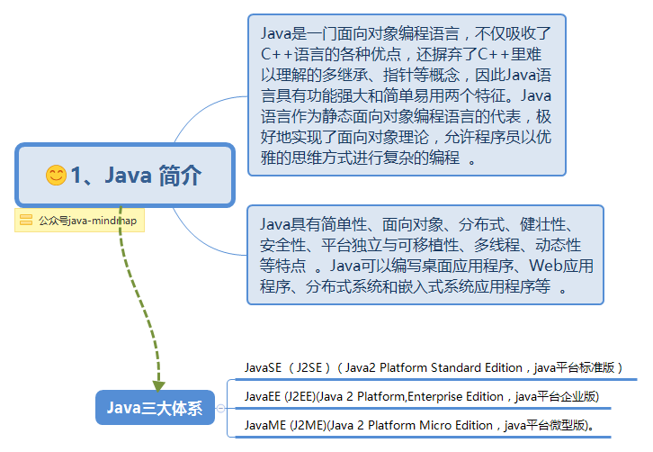
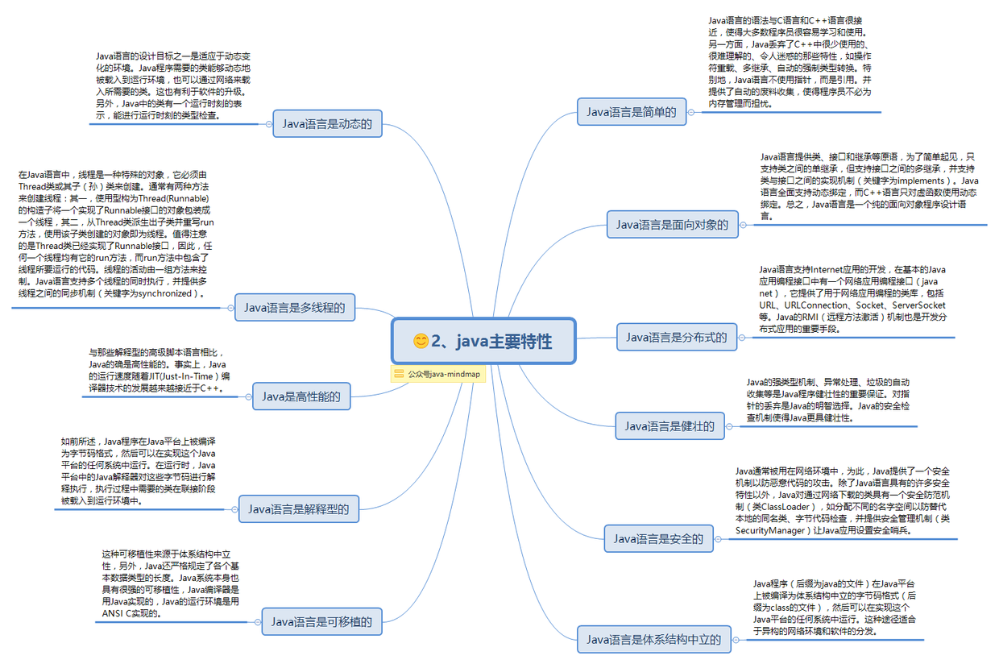
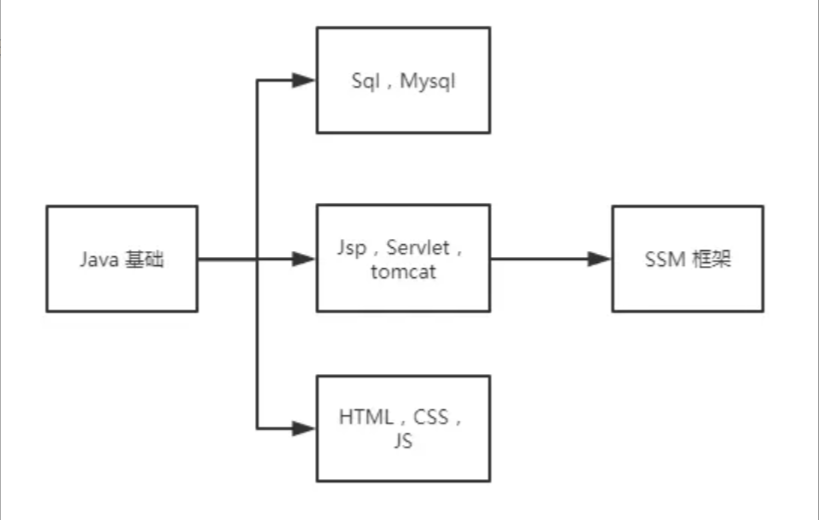

## 前言

学习 Java 也有了一段时间了，这段时间里，听过许多前辈的经验与分享，也看过许多大佬的文章和作品。找了个时间整理和总结了一下我个人到目前为止一路以来的听到看到或者自己感悟到的干货。

## 学习路线

对于想往 Java 后台这个方向发展的同学，可以按照以下路线入门：

* 先把 java 基础部分学完，重点关注多态继承等面向对象的概念，异常，IO，容器等，这部分建议通过视频来学习（毕向东，马士兵老师等的视频都是很经典的，虽然可能年代稍久远，但是万变不离其宗）。有些人可能会推荐看书来学习（如《head first java》等），但是个人认为，如果对于初学者，看书可能相对来说比较难理解，也很容易出现看不下去的情况，而许多优秀的教学视频更加生动，也更加容易理解。
* 然后就可以开始 javaweb 的学习了，Jsp，Servlet 相对来说比较老旧，但是对于初学者理解 HTTP 请求，理解前后端的交互，理解 MVC 模式，以及对以后框架的学习还是非常有帮助的；除此之外，这个时候还需要掌握数据库的知识，以及一些基础的前端知识。
* 等到以上都搞定之后，你就可以开始你的第一个 javaweb 项目了，可以尝试完成一个具有登陆注册，增删查改等基本功能的小项目，融入自己的想法，或者在网上或者 github 上也可以找到许多练手的例子。
* 以上只是 javaweb 的基础部分，接下来你还要完成框架的学习，spring + springMVC + mybatis 是现今比较流行的框架组合，到了这部分，就要好好花多点时间来钻研学习了，框架的学习同样建议看视频来先过一遍，初步熟悉了解，再通过代码实践，项目实战以及书本来加强巩固。

## 书籍

| 书名                                        | 介绍                                                                                              |
| ------------------------------------------- | :------------------------------------------------------------------------------------------------ |
| **《JSP & Servlet 学习笔记》**        | 非常适合入门 JSP Servlet 的一本书，通俗易懂，书里写的一个微博小项目也很适合在学习的时候跟着一起做 |
| **《Java核心技术·卷 I》**            | 比较适合入门的一本经典 java 书籍，相比 java 编程思想等更浅显易懂，也可以作为工具书使用            |
| **《Spring 实战》**                   | spring 的一本经典书籍，讲的十分全面，十分值得一看                                                 |
| **《算法》**                          | 简单明了的书名，java 实现的算法书，比起《算法导论》更适合入门，自然也十分易懂                     |
| **《Head First 设计模式》**           | 非常有趣的一本书，可以把每一个设计模式讲得十分生动                                                |
| **《图解 HTTP》**                     | 让你了解程序员都必须懂的 HTTP                                                                     |
| **《深入理解 Java 虚拟机（第2版）》** | 进阶书籍，提升Java功力之良药，当然也比较难懂                                                      |
| **《高性能 MySQL》**                  | MySQL的中高级教程，所以 MySQL 入门就不要看这个啦                                                  |
| **《Java并发编程实战》**              | 看“并发”俩字就知道这是一本 Java 进阶书籍                                                        |
| **《Java 8 实战》**                   | Java 8 的新增功能是 Java 发生的一次很大的变化，这本书也全面讲解了 java 8 的新特性                 |

## 参考文献

* [阿里巴巴Java开发手册](http://techforum-img.cn-hangzhou.oss-pub.aliyun-inc.com/1528269849853/Java_manual.pdf)
