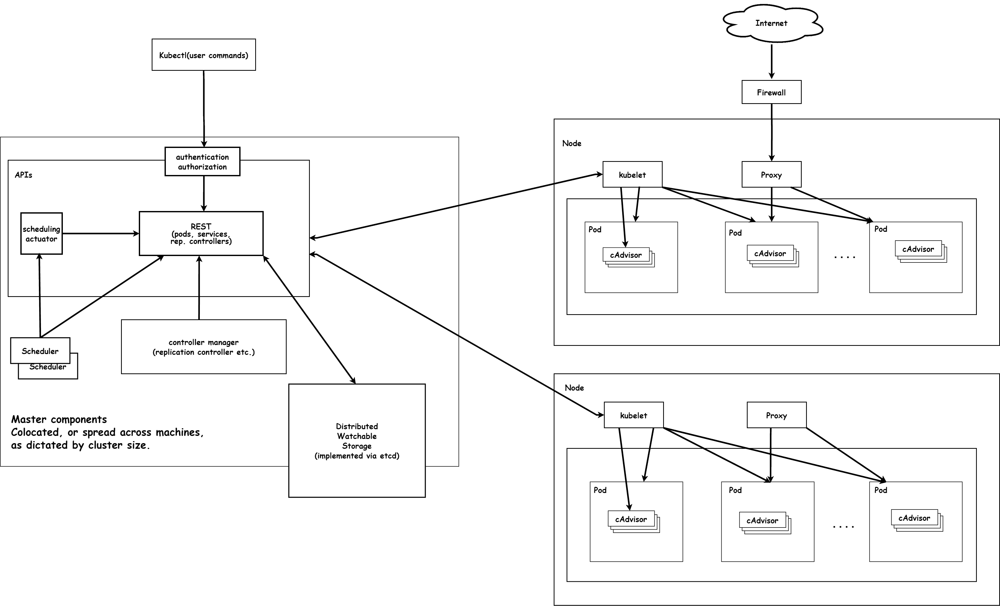

## 简介

***Kubernetes是容器集群管理系统工具** ，是一个开源的平台，可以实现容器集群的自动化部署、自动扩缩容、维护等功能。Kubernetes的名字来自希腊语，意思是“舵手” 或 “领航员”，K8s是将8个字母“ubernete”替换为“8”的缩写。*

## 起源

***大规模容器集群管理工具，从Borg到Kubernetes***

::: info Kubernetes

在Docker 作为高级容器引擎快速发展的同时，Google也开始将自身在容器技术及集群方面的积累贡献出来。在Google内部，容器技术已经应用了很多年，Borg系统运行管理着成千上万的容器应用，在它的支持下，无论是谷歌搜索、Gmail还是谷歌地图，可以轻而易举地从庞大的数据中心中获取技术资源来支撑服务运行。 **Kubernetes项目来源于Borg** ，可以说是集结了Borg设计思想的精华，并且吸收了Borg系统中的经验和教训。

Kubernetes作为容器集群管理工具，于**2015年7月22日迭代到 v 1.0**并正式对外公布，这意味着这个开源容器编排系统可以正式在生产环境使用。与此同时，谷歌联合Linux基金会及其他合作伙伴共同成立了CNCF基金会( Cloud Native Computing Foundation)，并将Kuberentes 作为首个编入CNCF管理体系的 **开源项目** ，助力容器技术生态的发展进步。

k8s github链接: [github.com/kubernetes/...](https://github.com/kubernetes/kubernetes)

:::

## K8s架构

*Kubernetes集群包含有节点代理kubelet和Master组件(APIs, scheduler, etc)，一切都基于分布式的存储系统。下面这张图是Kubernetes的架构图。*

