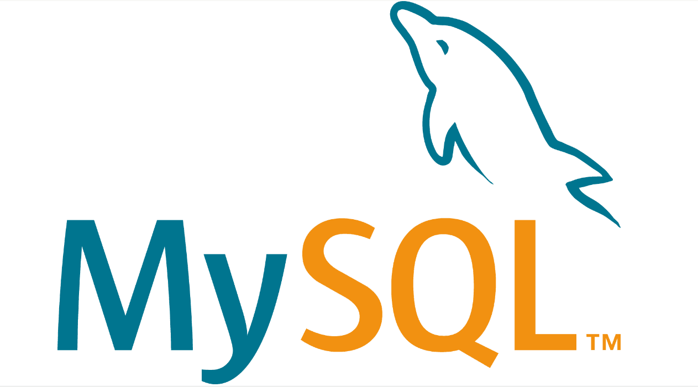

## 初识数据库

*要学习数据库首先要先搞清楚三个概念*

::: info 数据库

* 数据库(DB)：是存储数据的仓库
* 数据库管理系统(DBMS)：管理数据库的大型软件
* SQL：通过SQL操作数据库管理系统操作数据库，对数据库进行增删改查等

:::

*由此我们可以知道数据库就是安装在操作系统之上的数据仓库，用于存储数据*

## 数据库分类

*我们也先认识一个概念->关系型数据库*

*关系型数据库：通过二维表对数据进行存储的数据库*

::: info 关系型数据库和非关系型数据库

* 关系型数据库SQL(Structured Query Language)：Oracle、MySQL、Sql Serves、DB2、SQLlite
* 非关系型数据库NoSQL(Not Only SQL)：Redis、MongoDB

:::
