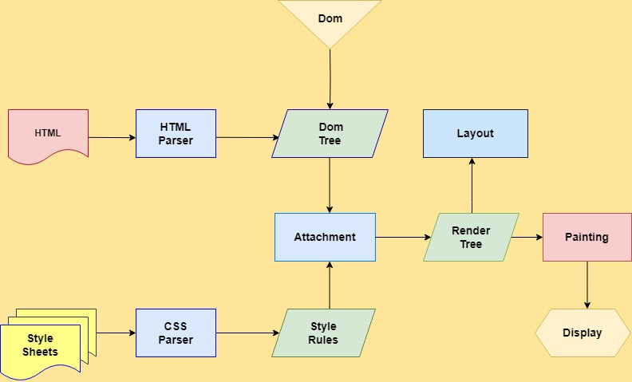
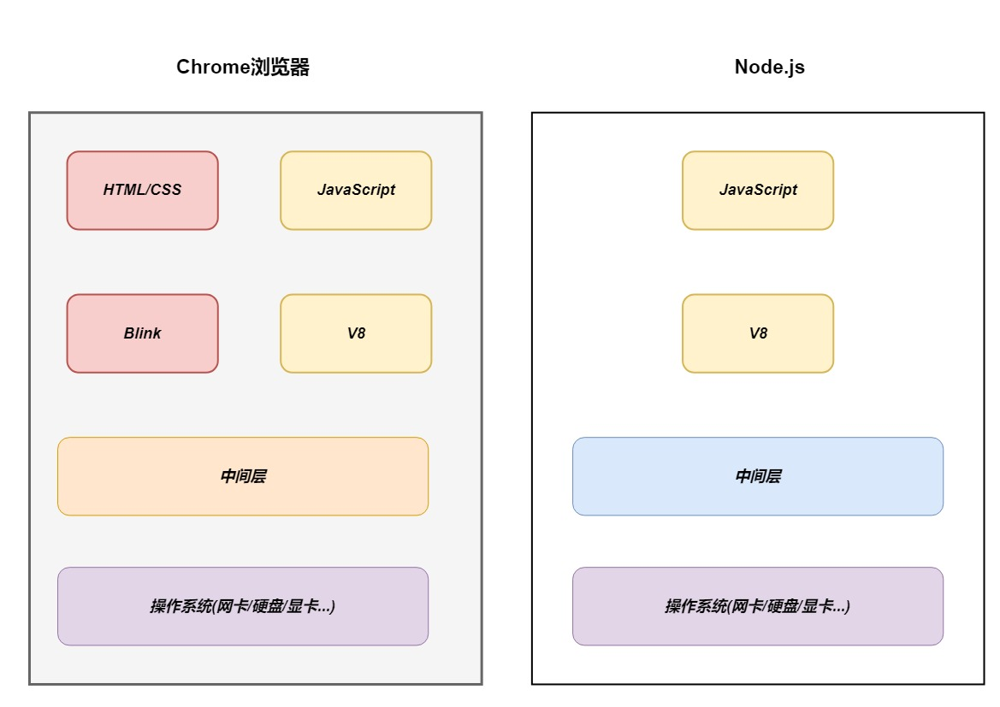
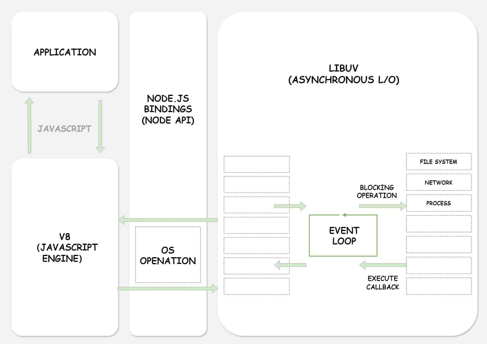

## 什么是Node.js

*Node.js是一个基于V8 JavaScript 引擎的JavaScript 运行时的环境。*

::: warning 浏览器内核

`GECKO `早期网景和火狐浏览器使用;

`Trident IE4~IE11` 浏览器使用;

`Webkit` `Safari` 浏览器使用;

`Blink Chrom`、`Chrome`、`Edge`、`Opera`浏览器使用。

:::

::: info 浏览器内核指的就是浏览器的排版引擎

排版引擎、也成为了浏览器引擎、页面渲染引擎或样板引擎

:::

::: warning 渲染引擎工作的原理

*想更加了解JavaScript运行原理可以看此文章 [JavaScript运行原理](https://juejin.cn/post/7073901189212930084)*

:::

## 浏览器和Node.js架构区别

::: info 如图所示

:::

## Node.js架构

*我们编写的JavaScript代码会经过V8引擎，再通过Node.js的Bindings，将任务放到Libuv的事件循环中*

*libuv（ Unicorn Velociraptor—独角伶盗龙）是使用C语言编写的库*

*libuv提供了事件循环、文件系统读写、网络IO、线程池等等内容*

## Node的版本工具

*快速更新或切换多个版本时，可以借助于一些工具*

::: info  Node的版本工具

`nvm`： Node Version Manager

：Interactively Manage Your Node.js Versions（交互式管理你的Node.js版本） （以上两个都不支持windows）

:::
