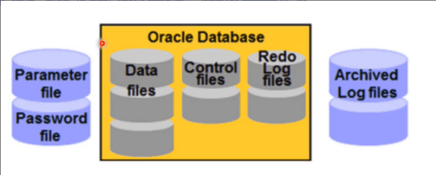
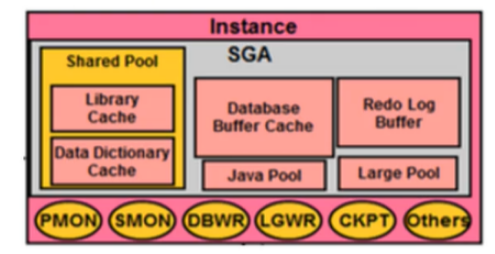
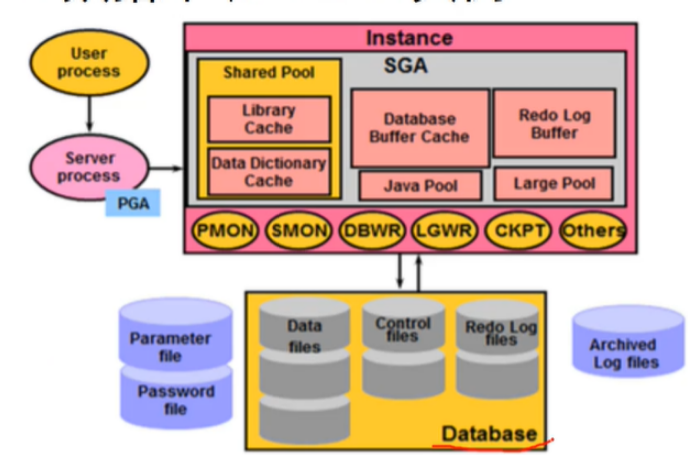
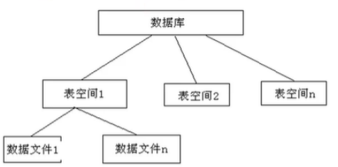

## 什么是数据库

::: info 数据库

数据库DB：存放数据的仓库

数据库管理系统DBMS：数据库系统中对数据进行管理的软件系统

数据管理员DBA：是负责对数据库进行规划、设计、协调、维护和管理的人员

:::

## 什么是Oracle

Oracle是一款对象关系型数据库

::: info 特点

* 性能优越，大型数据库中的典范
* 是对象关系型的数据库管理系统
* 应用广泛
* 在数据安全性与数据完整性控制方面性能优越
* 跨操作平台，跨硬件平台的数据互操作能力

:::

## Oracle体系结构

平常所说的Oracle或Oracle数据库指的是Oracle数据库管理系统

那么它有两部分组成：即Oracle数据库和Oracle实例

## Oracle数据库

物理存在，就是实时存在的文件

概念：相关的操作系统文件集合，这些文件组织到一起，成为一个逻辑整体，即为Oracle数据库



::: warning 三种必须的文件

* 数据文件：数据的存储仓库
* 控制文件：记录了数据库的名字。一旦控制文件损毁，数据库会宕机，用户不能编辑，自动生成
* 重做日志文件：事务日志，用于恢复

:::

Oracle数据库必须要与内存里实例合作，才能对外提供数据管理服务

## Oracle的实例

::: info 概念

位于物理内存里的数据结构，它由操作系统的多个后台进程和一个共享的内存池所组成，共享的内存池可以被所有进程访问。

::: warning SGA

Oracle实例=进程+进程所使用的内存（SGA）



:::

## Oracle数据库和Oracle实例



::: info 当某个用户发出更新数据的命令，当数据被修改时

* 系统会产生重做日志，并记录在重做日志缓存区(Redo Log Buffer)中
* 修改后的数据，存在实例中的数据缓冲区(Database Buffer Cache)内
* 重做日志缓存区通过进程LGWR写入到数据的重做日志文件(Redo Log files)
* 数据缓存区的内容通过DBWR写人到数据文件(Data files)中

:::

## Oracle数据库与实例区别

::: info 区别

实例就是Oracle的进程和内存，数据库就是保存数据的物理文件

一个和多个实例访问一个数据库，但是一个实例一次只能访问一个数据库

:::

## Oracle的常用命令

::: info Oracle中常用的SQL Plus命令

`Connect `切换连接用户

`Show user `显示当前登录的用户

`Host<dos命令>` 执行操作系统命令

`Spool` 路径 导出记录到文本

`Clear screen` 清屏

`Desc` 显示表结构

`Exit` 退出

:::

## 用系统用户登录Oracle

::: info 只有合法的用户账号才能访问Oracle数据库

::: warning Oracle默认的系统用户

* sys:权限最大的用户，超级用户，只能用sys/dba登录
* system：没有sys权限大，可以直接登录
* sysman:用于管理EM管理的用户
* scott：普通用户，默认密码时tiger

```sql
conn sys/oracle as sysdba

conn system/oracle
```

:::

## Oracle用户登录的语法格式

```sql
conn sys/oracle @orcl as sysdba

<!--连接默认数据库-->
conn sys/oracle as sysdba 

conn system/oracle
```

## 启用Scott用户

```sql
<!--切换到sys用户-->
conn sys/oracle as sysdba

<!--解锁-->
alter user scott account unlock

<!--登录-->
conn scott/tiger
```

## 创建表空间

::: info 什么是表空间

表空间实际上时数据库上的逻辑存储结构

表空间实际由一个或多个数据文件构成的，数据文件的位置和大小可以由我们用户自己来定义。



:::

::: info 表空间的分类

* 永久表空间：系统空间，存储了数据字典，存储了数据信息，用户信息等
* 临时表空间：必须存在，当commit后，会从临时表空间清空，然后存到永久表空间去。
* UNDO表空间：commit后发现搞错了，可以用这个恢复

:::

::: info 创建表空间的语法格式

```sql
conn sys/oracle as sysdba
<!--创建表空间-->
create tablespace test1_tablespace datafile 'test1file.dbf' size 10m;

<!--创建临时表空间-->
create temporary tablespace temptest1_tablespace tmpfile 'tempfile1.dbf' size 10m;

<!--查询表空间的位置-->
select file_name from dba_data_files where tablespace_name = 'TEST1——TABLESPACE'

```

:::
