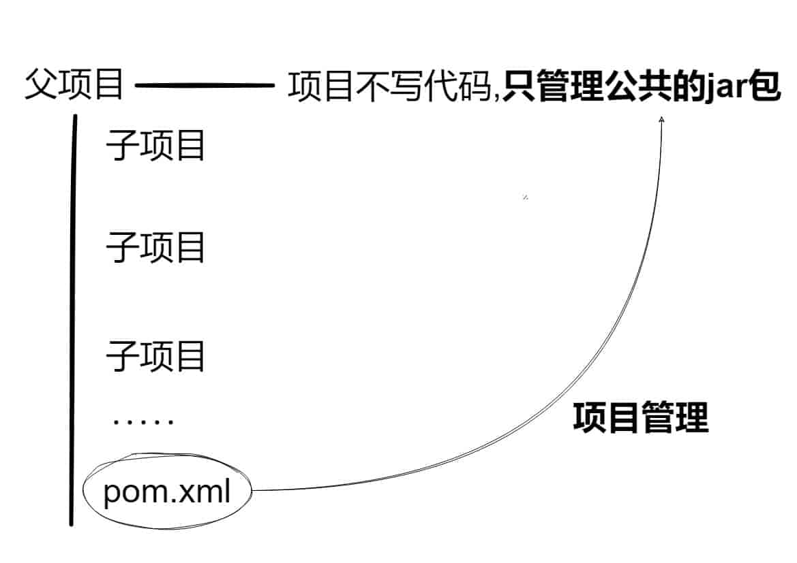

## 前言

*Spring Boot是由Pivotal团队提供的全新框架，其设计目的是用来简化新Spring应用的初始搭建以及开发过程。该框架使用了特定的方式来进行配置，从而使开发人员不再需要定义样板化的配置。通过这种方式，Spring Boot致力于在蓬勃发展的快速应用开发领域(rapid application development)成为领导者。*

## 认识SpringBoot

::: info 认识SpringBoot

为简化Spring项目配置而生

使用maven的方式对Spring应用开发进行进一步封装和简化

为了简化spring应用搭建，开发，部署，监控的开发工具

官网：[spring.io](https://spring.io/projects/spring-boot)

:::

::: info #SoringBoot特点

1. 创建独立的Spring应用程序
2. 嵌入的Tomcat，无需部署WAR文件
3. 简化Maven配置
4. 自动配置Spring
5. 提供生产就绪型功能，如指标，健康检查和外部配置
6. 绝对没有代码生成和对XML没有要求配置

:::

## Maven的父子项目认识

::: info Maven

咱们刚才说了，SpringBoot是使用maven(注:也可以使用Gradle)的方式对Spring应用开发进行进一步的封装和简化。所以咱们在学习SpringBoot前需要学习Maven，而在练习前咱们会创建多个练习demo,因此，在这里需要先进行Maven父子模块讲解(已经了解Maven父子模块可以忽略本章)

* idea只能创建一个项目，所以咱们会以模块的方式来进行项目的创建
* 咱们会先创建一个父项目，然后在里面创建多个子模块

:::

::: info 创建Maven项目

::: warning 开发工具

开发工具建议使用IDEA

:::

## 教程参考

*教程内容可参考以下文章 & 讨论：*

* [Spring Boot教程一：工程构建](http://blog.csdn.net/wang_shuyu/article/details/78739281 "http://blog.csdn.net/wang_shuyu/article/details/78739281")
* [Spring Boot教程二：读取配置文件](http://blog.csdn.net/wang_shuyu/article/details/78740209 "http://blog.csdn.net/wang_shuyu/article/details/78740209")
* [Spring Boot教程三：log4j记录日志](http://blog.csdn.net/wang_shuyu/article/details/78742189 "http://blog.csdn.net/wang_shuyu/article/details/78742189")
* [Spring Boot教程四：使用Druid和监控配置](http://blog.csdn.net/wang_shuyu/article/details/78743687 "http://blog.csdn.net/wang_shuyu/article/details/78743687")
* [Spring Boot教程五：整合mybaits](http://blog.csdn.net/wang_shuyu/article/details/78744338 "http://blog.csdn.net/wang_shuyu/article/details/78744338")
* [Spring Boot教程六：集成swagger2](http://blog.csdn.net/wang_shuyu/article/details/78744555 "http://blog.csdn.net/wang_shuyu/article/details/78744555")
* [Spring Boot教程七：集成redis](http://blog.csdn.net/wang_shuyu/article/details/78793849 "http://blog.csdn.net/wang_shuyu/article/details/78793849")
* [Spring Boot教程八：捕获全局异常](http://blog.csdn.net/wang_shuyu/article/details/79162613 "http://blog.csdn.net/wang_shuyu/article/details/79162613")
* [Spring Boot教程九：捕获全局异常（二）](http://blog.csdn.net/wang_shuyu/article/details/79304337 "http://blog.csdn.net/wang_shuyu/article/details/79304337")
* [Spring Boot教程十：数据库读写分离](http://blog.csdn.net/wang_shuyu/article/details/79304364 "http://blog.csdn.net/wang_shuyu/article/details/79304364")
* [Spring Boot教程十一：集成elasticsearch](https://blog.csdn.net/wang_shuyu/article/details/79820496 "https://blog.csdn.net/wang_shuyu/article/details/79820496")
* [Spring Boot教程十二：集成Kafka](https://blog.csdn.net/wang_shuyu/article/details/80971090 "https://blog.csdn.net/wang_shuyu/article/details/80971090")
* [Spring Boot教程十三：多数据源配置](https://blog.csdn.net/wang_shuyu/article/details/81335227 "https://blog.csdn.net/wang_shuyu/article/details/81335227")
* [Spring Boot教程十四：基于自定义注解的AOP数据源自动切换](https://blog.csdn.net/wang_shuyu/article/details/81384481 "https://blog.csdn.net/wang_shuyu/article/details/81384481")
* [Spring Boot教程十五：多线程](https://blog.csdn.net/wang_shuyu/article/details/83477861 "https://blog.csdn.net/wang_shuyu/article/details/83477861")
* [Spring Boot教程十六：SpringBoot注入类实现多线程](https://blog.csdn.net/wang_shuyu/article/details/83657366 "https://blog.csdn.net/wang_shuyu/article/details/83657366")
