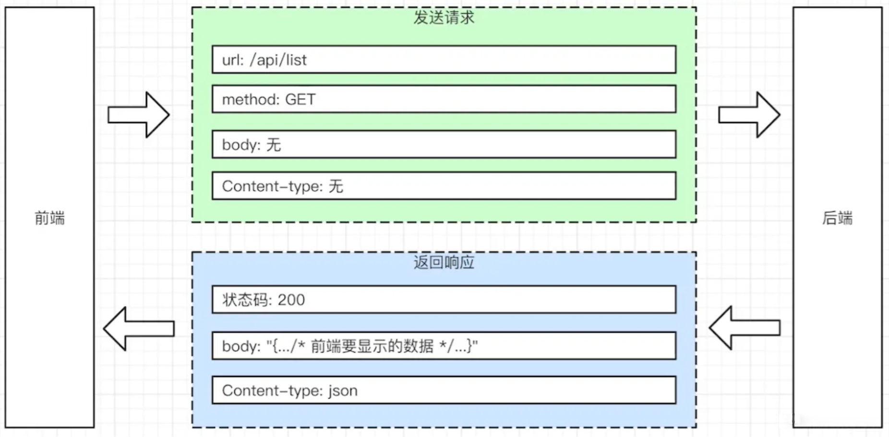
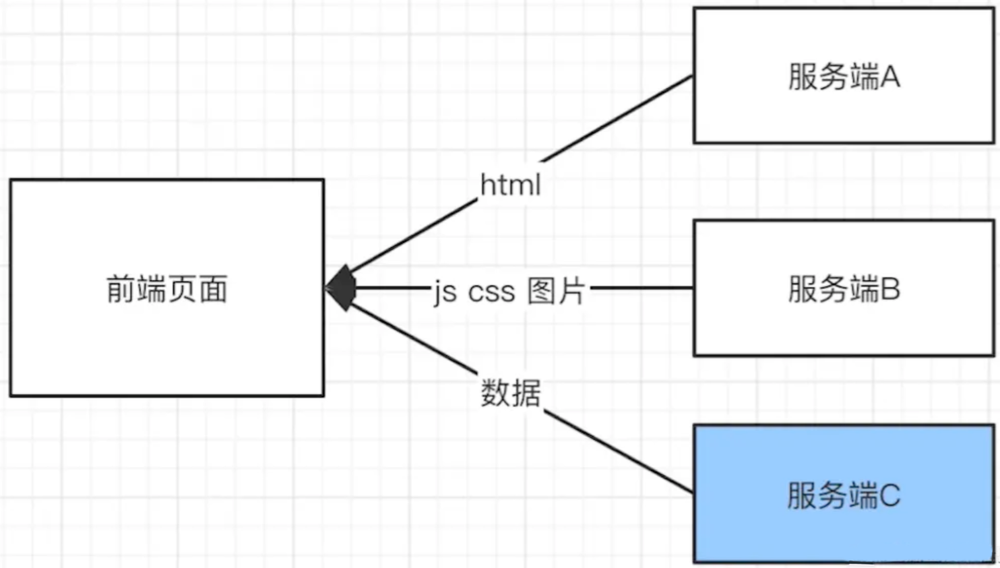
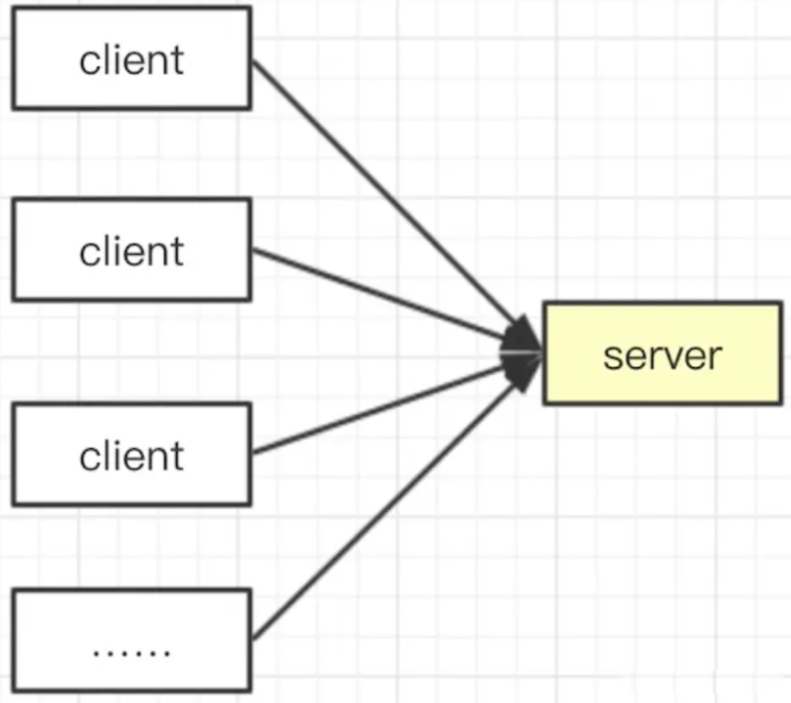

## 后端

* 后端，又称服务端、server 端；
* 前端是用户可见、可操作的部分，如树枝树叶；
* 服务端为前端提供 “支撑”和 “营养”，如树根；

## 后端的职责

* 提供前端要展示的数据；
* 接收前端要提交的数据；
* 存储数据（软件公司非常看重数据，会收集各种数据）；

## 后端的表现形式

* 前端 [Axios ](https://www.axios-http.cn/)要调用某个接口，比如使用 get 请求获取数据，post 请求提交数据；
* 这个接口，就是服务端提供的；

## 前后端交互通讯-HTTP协议

* 超文本传输协议 `Hyper Text Transfer Protocol`
* 规定了客户端和服务端如何通讯；
* 是互联网世界数据通讯的标准和基石；

## HTTP - Request

* Request：请求，前端发送给服务端；
* Request Body：请求是发送给后端的数据；
* Request Content-type：发送数据的格式，如 JSON 格式；

## HTTP - Response

* Response：返回/响应，服务端返回给前端;
* Response Body：后端返回给前端的数据；
* Response Content-type：返回数据的格式，如 JSON 格式；

## 演示一个 Get 请求

## 不同资源可能来自不同的域名

* HTML可能来自一个单独的域名
* JS CSS可能来自一个独立的域名
* 数据可能来自一个独立的域名
* 不同域名可对应不同服务端

后端主要也可分为做静态服务（处理html css js 图片等）和数据服务（提供数据接口）

## 后端如何处理并返回数据

##### 定义前端请求的 url 规则 - 路由（前端 Ajax 请求需要 url）

##### Request 获取数据，用 Response 返回数据

* 也可简称为 req 和 res
* 通过 Request 可获取：method url body
* 通过 Response：可设置：状态码，Content-type，body

##### 读取和存储数据 - 数据库

* 数据库，专职做数据的存储和查询
* 数据库是一个独立的系统，不是 nodejs 专属的
* 基本操作：查询、新增、删除、修改、排序等都需要查询条件

## 后端开发和前端开发的区别

## 服务稳定性

* 单个客户端可以意外挂掉，但是服务端不能
* server 端可能会遭受各种恶意攻击和误操作

## 考虑 CPU 和内存（优化、扩展）

* 客户端独占一个浏览器，内存和 CPU 都不是问题
* server 端要承载很多请求，CPU 和内存都是稀缺资源

## 日志记录

* 前端也会参与写日志，但只是日志的发起方，不关心后续
* server 端要记录日志、存储日志、分析日志，前端不关心

## 安全

* server 端要随时准备接收各种恶意攻击，前端则少很多
* 如：越权操作，数据库攻击等

## 集群和服务拆分

* 产品发展速度快，流量可能会迅速增加
* 如何通过扩展机器和服务拆分来承载大流量？
