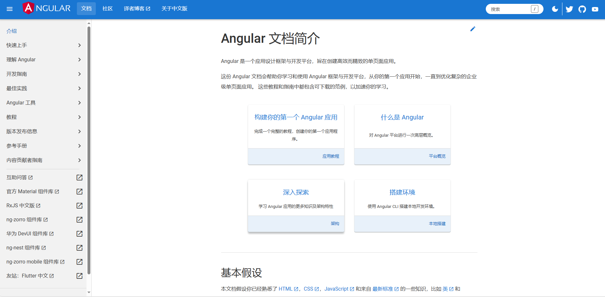

## Angular

网址：[Angular.js](https://angular.cn/)

AngularJS是一个应用设计框架与[开发平台](https://baike.baidu.com/item/%E5%BC%80%E5%8F%91%E5%B9%B3%E5%8F%B0/8956190?fromModule=lemma_inlink)，用于创建高效、复杂、精致的[单页面应用](https://baike.baidu.com/item/%E5%8D%95%E9%A1%B5%E9%9D%A2%E5%BA%94%E7%94%A8/18753779?fromModule=lemma_inlink)，通过新的属性和表达式扩展了 [HTML](https://baike.baidu.com/item/HTML/97049?fromModule=lemma_inlink)，实现一套框架，多种平台，移动端和桌面端。

