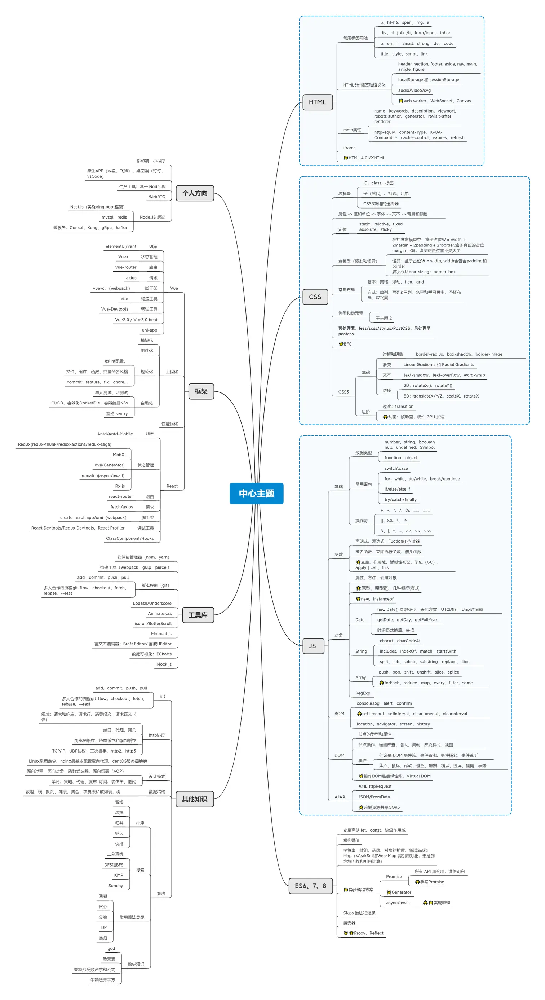

## 前端

前端即网站前台部分，运行在PC端，移动端等浏览器上展现给用户浏览的网页。随着[互联网技术](https://baike.baidu.com/item/%E4%BA%92%E8%81%94%E7%BD%91%E6%8A%80%E6%9C%AF/617749?fromModule=lemma_inlink)的发展，[HTML5](https://baike.baidu.com/item/HTML5/4234903?fromModule=lemma_inlink)，[CSS3](https://baike.baidu.com/item/CSS3/4059544?fromModule=lemma_inlink)，前端框架的应用，[跨平台](https://baike.baidu.com/item/%E8%B7%A8%E5%B9%B3%E5%8F%B0/8558902?fromModule=lemma_inlink)[响应式网页设计](https://baike.baidu.com/item/%E5%93%8D%E5%BA%94%E5%BC%8F%E7%BD%91%E9%A1%B5%E8%AE%BE%E8%AE%A1/2519669?fromModule=lemma_inlink)能够适应各种[屏幕分辨率](https://baike.baidu.com/item/%E5%B1%8F%E5%B9%95%E5%88%86%E8%BE%A8%E7%8E%87/2193029?fromModule=lemma_inlink)，合适的动效设计，给用户带来极高的[用户体验](https://baike.baidu.com/item/%E7%94%A8%E6%88%B7%E4%BD%93%E9%AA%8C/1994?fromModule=lemma_inlink)。

Github友情链接：[前端手写文件汇总](https://github.com/yaozongbin/HTML5)

---
