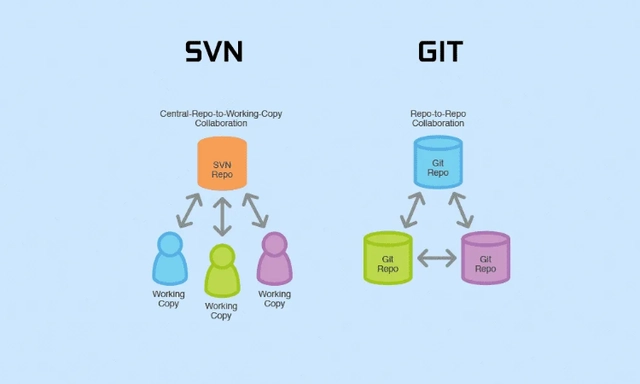
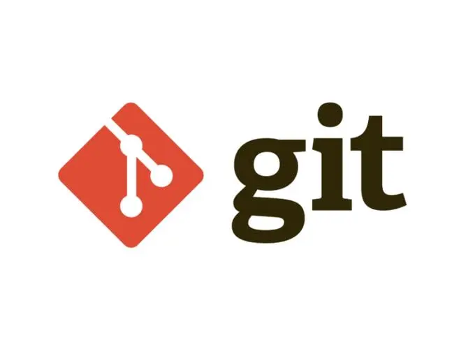

## 1.Git是一款分布式源代码管理工具(版本控制工具)

::: info Git?

Git得其数据更像是一系列微型文件系统的快照。使用Git，每次提交或保存项目状态时，Git基本上都会记录当时所有文件的外观，并存储对该快照的引用。为了提高效率，如果文件没有改变，Git不会再次存储文件，只是指向它已存储的上一个相同文件的链接。Git认为它的数据更像是一个快照流，会将数据作为项目的快照存储一段时间。可以有效、高速地处理从很小到非常大的项目版本管理。 也是Linus Torvalds为了帮助管理Linux内核开发而开发的一个开放源码的版本控制软件。（一句话概括：Git是目前世界上最先进的分布式版本控制系统。 Git是免费、开源的！ 最初Git是为辅助 Linux 内核开发的，来替代 BitKeeper  作者👨🏻‍🦲 Linux和Git之父李纳斯·托沃兹（Linus Benedic Torvalds）1969、芬兰人）

:::

## 2.**Git数据库介绍**

::: info GitDataBase

Git中的大多数操作只需要本地文件和资源来运行 - 通常不需要来自网络上另一台计算机的信息。当您在Git中执行操作时，几乎所有操作都只将数据添加到Git数据库。很难让系统做任何不可撤销的事情或者以任何方式擦除数据。与任何VCS一样，您可能会丢失或搞乱尚未提交的更改，但在将快照提交到Git之后，很难丢失，尤其是在您经常将数据库推送到另一个存储库时。

:::

## 3.Git的使用

::: warning Use

当你需要做一个大工程的时候，文件的管理无疑是非常庞大的工作，因为你需要不断的修改更新文件内容，同时可能还要保留旧版本保证可以复原，这样就需要备份多个版本的文件。

并且在大多数情况下一个工程需要在多数人来共同维护，那么这种情况下不同人之间修改内容的合并也是非常麻烦的，这时使用git就可以很轻松的解决这些问题。

:::

## 4.优缺点

**优点**：

* 适合分布式开发，强调个体。
* 公共服务器压力和数据量都不会太大。
* 速度快、灵活。
* 开发者之间可以很容易的解决冲突。
* 离线工作。

**缺点：**

* 模式上比SVN更加复杂。
* 不符合常规思维。
* 代码保密性差，一旦开发者把整个库克隆下来就可以完全公开所有代码和版本信息。

官网：[https://git-scm.com/](https://git-scm.com/ "https://git-scm.com/")

源码：[https://github.com/git/git/](https://github.com/git/git/ "https://github.com/git/git/")
