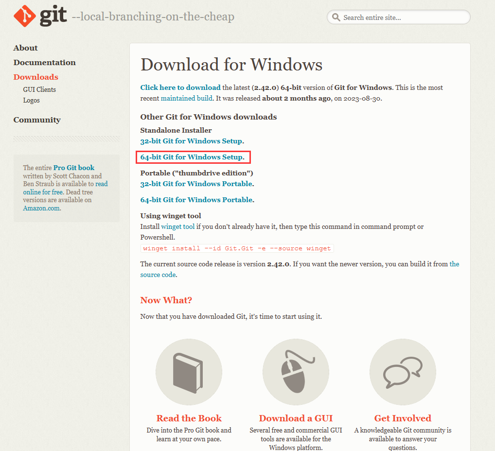
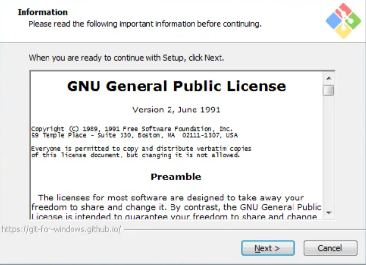
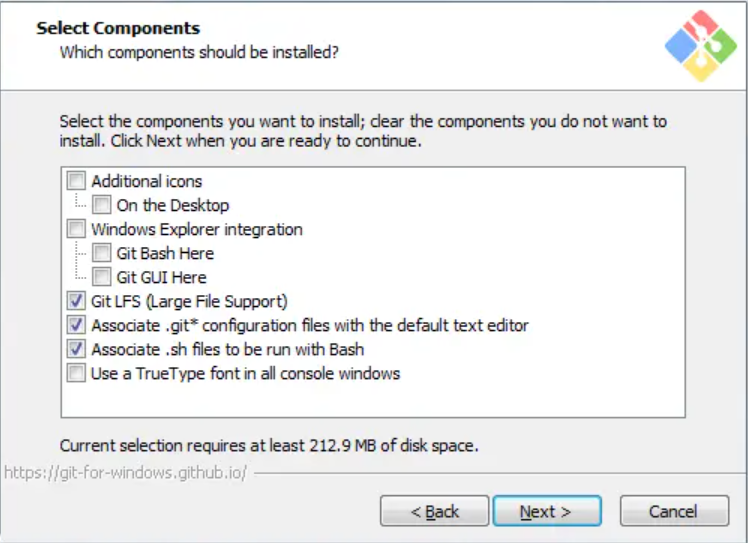
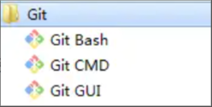
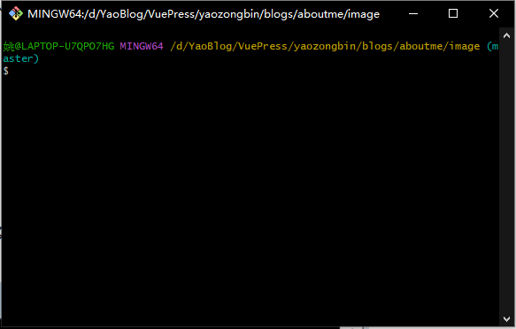
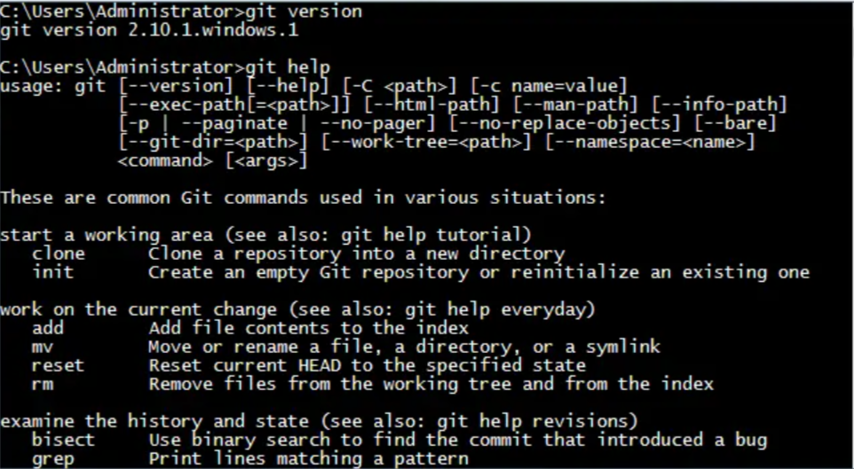
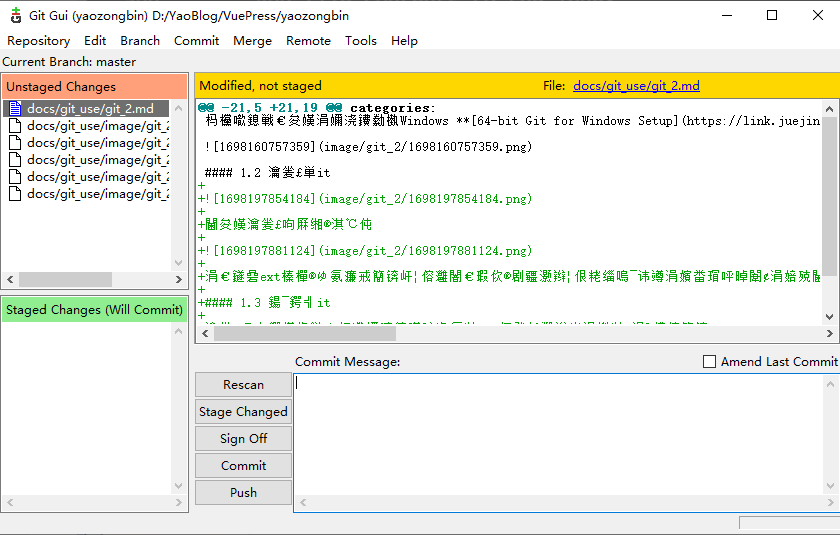
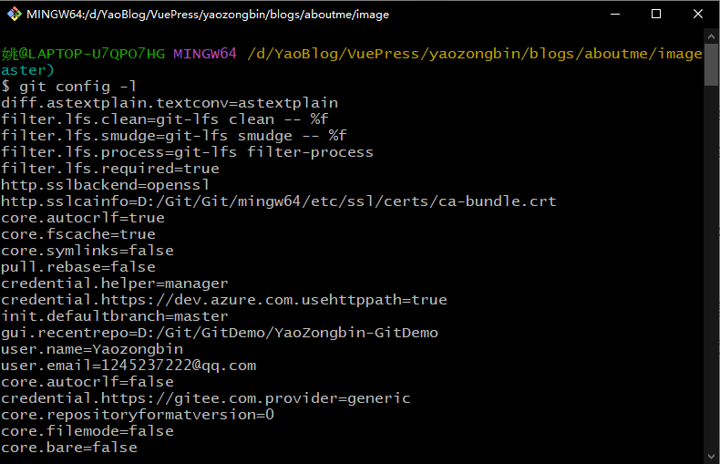
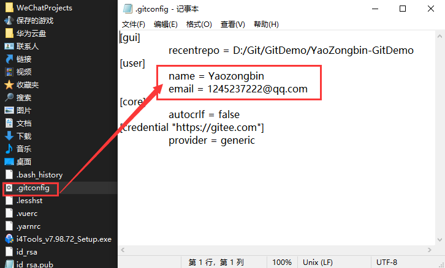

## 1.搭建Git工作环境

### 1.1 下载Git

打开 [git官网](https://git-scm.com/ "https://git-scm.com/")，下载git对应操作系统的版本。


选择版本：


这里我选择下载的是Windows **[64-bit Git for Windows Setup](https://git-scm.com/download/win "https://github.com/git-for-windows/git/releases/download/v2.14.1.windows.1/Git-2.14.1-64-bit.exe")**



### 1.2 安装git



选择安装配置信息



一直Next默认就好了，如果需要设置就要仔细读一下安装界面上的选项。

### 1.3 启动git

安装成功后在开始菜单中会有Git项，菜单下有3个程序：



* **Git Bash：** Unix与Linux风格的命令行，使用最多，推荐最多

  
* **Git CMD：** Windows风格的命令行

  
* **Git GUI** ：图形界面的Git，不建议初学者使用，尽量先熟悉常用命令

  

### 1.4 Bash基本操作命令

* **cd：改变目录。**
* **cd . . 回退到上一个目录，直接cd进入默认目录**
* **pwd : 显示当前所在的目录路径。**
* **ls(ll): 都是列出当前目录中的所有文件，只不过ll(两个ll)列出的内容更为详细。**
* **touch : 新建一个文件 如 touch index.js 就会在当前目录下新建一个index.js文件。**
* **rm: 删除一个文件, rm index.js ，就会把index.js文件删除。**
* **mkdir: 新建一个目录,就是新建一个文件夹。**
* **rm -r : 删除一个文件夹, rm -r src 删除src目录， 好像不能用通配符。**
* **mv 移动文件, mv index.html src index.html 是我们要移动的文件, src 是目标文件夹,当然, 这样写,必须保证文件和目标文件夹在同一目录下。**
* **reset重新初始化终端/清屏。**
* **clear 清屏。**
* **history 查看命令历史。**
* **help 帮助。**
* **exit 退出。**
* **#表示注释**

---

### 1.5 Git配置 — git config -l

使用git config -l 可以查看现在的git环境详细配置



查看不同级别的配置文件:

```bash
# 查看系统config
git config --system --list
　　
# 查看当前用户（global）配置
git config --global  --list
 
# 查看当前仓库配置信息
git config --local  --list
```

### 1.6 设置用户名与邮箱（用户标识，必要）

当你安装Git后首先要做的事情是设置你的用户名称和e-mail地址。这是非常重要的，因为每次Git提交都会使用该信息。它被永远的嵌入到了你的提交中：

```
 　　$ git config --global user.name "zhangguo"  #名称
 　　$ git config --global user.email zhangguo@qq.com   #邮箱
```



### 1.7 更多配置项

```bash
git config --global color.ui true   #打开所有的默认终端着色
git config --global alias.ci commit   #别名 ci 是commit的别名
[alias]  
co = checkout  
ci = commit  
st = status  
pl = pull  
ps = push  
dt = difftool  
l = log --stat  
cp = cherry-pick  
ca = commit -a  
b = branch 

user.name  #用户名
user.email  #邮箱
core.editor  #文本编辑器  
merge.tool  #差异分析工具  
core.paper "less -N"  #配置显示方式  
color.diff true  #diff颜色配置  
alias.co checkout  #设置别名
git config user.name  #获得用户名
git config core.filemode false  #忽略修改权限的文件  
```

所有config命令参数

```bash
语法: git config [<options>]  
  
文件位置  
    --global                  #use global config file 使用全局配置文件
    --system                  #use system config file 使用系统配置文件
    --local                   #use repository config file    使用存储库配置文件
    -f, --file <file>         #use given config file    使用给定的配置文件
    --blob <blob-id>          #read config from given blob object    从给定的对象中读取配置
  
动作  
    --get                     #get value: name [value-regex]    获得值：[值]名[正则表达式]
    --get-all                 #get all values: key [value-regex]    获得所有值：[值]名[正则表达式]
    --get-regexp          #get values for regexp: name-regex [value-regex]    得到的值根据正则
    --get-urlmatch            #get value specific for the URL: section[.var] URL    为URL获取特定的值
    --replace-all             #replace all matching variables: name value [value_regex]    替换所有匹配的变量：名称值[ value_regex ]
    --add                     #add a new variable: name value    添加一个新变量：name值
    --unset                   #remove a variable: name [value-regex]    删除一个变量名[值]：正则表达式
    --unset-all               #remove all matches: name [value-regex]    删除所有匹配的正则表达式：名称[值]
    --rename-section          #rename section: old-name new-name    重命名部分：旧名称 新名称
    --remove-section          #remove a section: name    删除部分：名称
    -l, --list                #list all    列出所有
    -e, --edit            #open an editor    打开一个编辑器
    --get-color               #find the color configured: slot [default]    找到配置的颜色：插槽[默认]
    --get-colorbool           #find the color setting: slot [stdout-is-tty]    发现颜色设置：槽[ stdout是TTY ]
  
类型  
    --bool                    #value is "true" or "false"    值是“真”或“假”。
    --int                     #value is decimal number    值是十进制数。
    --bool-or-int             #value is --bool or --int    值--布尔或int
    --path                    #value is a path (file or directory name)    值是路径（文件或目录名）
  
其它  
    -z, --null                #terminate values with NUL byte    终止值与null字节
    --name-only               #show variable names only    只显示变量名
    --includes                #respect include directives on lookup    尊重包括查找指令
    --show-origin             #show origin of config (file, standard input, blob, command line)    显示配置（文件、标准输入、数据块、命令行）的来源
```

---
