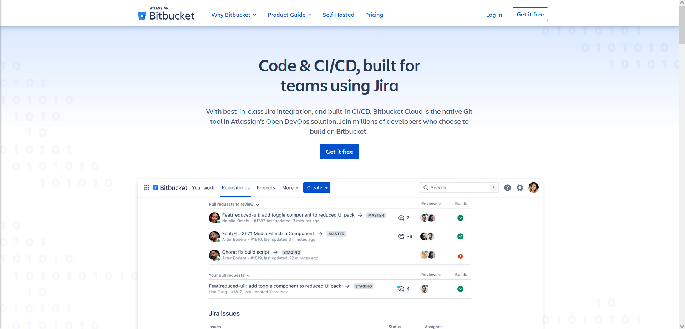

::: info CodeHostingPlatform

Git代码托管平台，首先推荐的是GitHub，好多好的开源项目都来自GitHub，但是GitHub只能新建公开的Git仓库，私有仓库要收费，有时候访问比较卡，如果你做的是一个开源项目，可以首选GitHub。下面推荐几个比较好的Git代码托管平台：

##### **Github**

关于GItHub相信大家都有耳闻，我就不详细介绍了。GitHub地址：[Github.com](https://github.com/ "https://github.com/")，其首页如图：

##### **Gitlab**

对于有些人，提到GitHub就会自然的想到Gitlab,Gitlab支持无限的公有项目和私有项目。Gitlab地址：[Gitlab.com](https://about.gitlab.com/ "https://about.gitlab.com/")，其首页截图如图：

##### **Bitbucket**

bitbucket 免费支持5个开发成员的团队创建无限私有代码托管库 。bitbucket地址：[bitbucket.org/](https://bitbucket.org/ "https://bitbucket.org/")，首页如图：

##### **Gitee**

Gitee（码云）是开源中国于2013年推出的基于Git的代码托管平台、企业级研发效能平台，提供中国本土化的代码托管服务。地址： [Gitee](https://gitee.com/ "https://coding.net/")

##### **Coding**

谈到coding.net,首先必须提的是速度快，功能与开源中国相似，同样一个账号最多可以创建1000个项目(5个私有)，也支持任务的创建等。coding.net地址：[coding.net/](https://coding.net/ "https://coding.net/")：

我个人比较推荐[GIthub](https://github.com/ "https://coding.net/") 、[Gitee](https://gitee.com/ "https://coding.net/")。

:::

---
