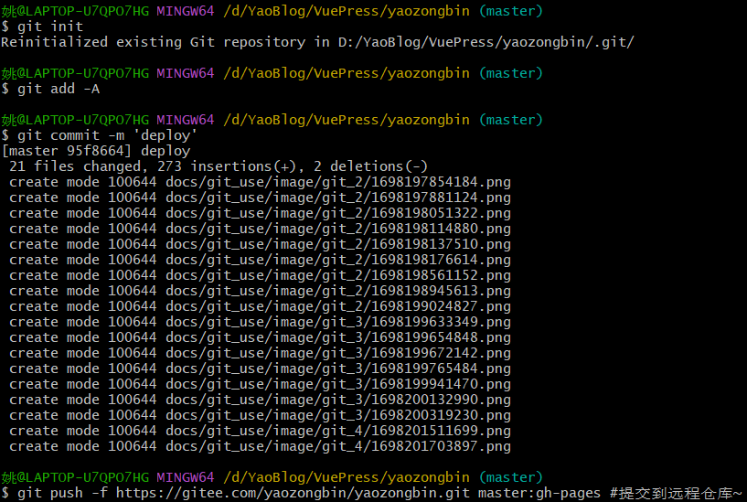

### 1. 常用操作指令

```bash
# 下载远程仓库的所有变动
$ git fetch [remote]

# 显示所有远程仓库
$ git remote -v

# 显示某个远程仓库的信息
$ git remote show [remote]

# 增加一个新的远程仓库，并命名
$ git remote add [shortname] [url]

# 取回远程仓库的变化，并与本地分支合并
$ git pull [remote] [branch]

# 上传本地指定分支到远程仓库
$ git push [remote] [branch]

# 强行推送当前分支到远程仓库，即使有冲突
$ git push [remote] --force

# 推送所有分支到远程仓库
$ git push [remote] --all

#简单查看远程---所有仓库
git remote  （只能查看远程仓库的名字）#查看单个仓库
git  remote show [remote-branch-name]

#新建远程仓库
git remote add [branchname]  [url]

#修改远程仓库
git remote rename [oldname] [newname]

#删除远程仓库
git remote rm [remote-name]

#获取远程仓库数据
git fetch [remote-name] (获取仓库所有更新，但不自动合并当前分支)
git pull (获取仓库所有更新，并自动合并到当前分支)

#上传数据，如git push origin master
git push [remote-name] [branch]
```

### 2.git clone 克隆

远程操作的第一步，通常是从远程主机克隆一个版本库，这时就要用到 `git clone`命令。

```bash
$ git clone <版本库的网址>
```

该命令会在本地主机生成一个目录，与远程主机的版本库同名。如果要指定不同的目录名，可以将目录名作为 `git clone`命令的第二个参数。

```bash
$ git clone <版本库的网址> <本地目录名>
```

`git clone`支持多种协议，除了HTTP(s)以外，还支持SSH、Git、本地文件协议等，下面是一些例子。

```bash
$ git clone http[s]://example.com/path/to/repo.git/
$ git clone ssh://example.com/path/to/repo.git/
$ git clone git://example.com/path/to/repo.git/
$ git clone /opt/git/project.git 
$ git clone file:///opt/git/project.git
$ git clone ftp[s]://example.com/path/to/repo.git/
$ git clone rsync://example.com/path/to/repo.git/
```

通常来说，Git协议下载速度最快，SSH协议用于需要用户认证的场合。各种协议优劣的详细讨论请参考[官方文档](http://git-scm.com/book/en/Git-on-the-Server-The-Protocols "http://git-scm.com/book/en/Git-on-the-Server-The-Protocols")。

### 3. 在命令行中同步本地仓库示例



Gitee中查看提交结果：


### 4.资源与资料下载

* 权威Git书籍[ ProGit（中文版）](http://git.oschina.net/progit/ "http://git.oschina.net/progit/")
* git官网：[git-scm.com](http://git-scm.com/ "http://git-scm.com/")
* git手册：[git-scm.com/docs](http://git-scm.com/docs "http://git-scm.com/docs")
* 网友整理的Git@osc教程，请[点击这里](http://git.oschina.net/oschina/git-osc/wikis/%E5%B8%AE%E5%8A%A9#%E7%BB%A7%E7%BB%AD%E9%98%85%E8%AF%BB "http://git.oschina.net/oschina/git-osc/wikis/%E5%B8%AE%E5%8A%A9#%E7%BB%A7%E7%BB%AD%E9%98%85%E8%AF%BB")；
* 一份很好的 Git 入门教程，请[点击这里](http://www.liaoxuefeng.com/wiki/0013739516305929606dd18361248578c67b8067c8c017b000/001373962845513aefd77a99f4145f0a2c7a7ca057e7570000 "http://www.liaoxuefeng.com/wiki/0013739516305929606dd18361248578c67b8067c8c017b000/001373962845513aefd77a99f4145f0a2c7a7ca057e7570000")；

---
